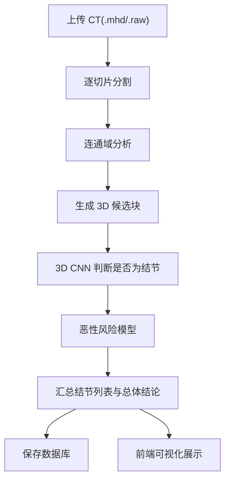

# LungCancerScreening 项目拆解与面试笔记

> [!summary]
> 这是一个“从 CT 原始影像到 Web 可视化诊断结果”的全流程肺癌筛查项目。
> 它不是单一模型，而是一个完整系统，包含：
> 1. 数据读取与缓存
> 2. 结节分割模型
> 3. 结节真假分类模型
> 4. 良恶性分类模型
> 5. 整体推理评估脚本
> 6. Flask 后端
> 7. React 前端

## 1. 面试时先怎么介绍这个项目

如果面试官问“这个项目是做什么的”，你可以先用下面这段话：

这个项目是一个 AI 辅助肺癌筛查系统，核心输入是 CT 扫描文件，输出是结节检测结果、恶性风险分析以及可视化页面。整体采用三阶段流水线：

1. 先用 2D UNet 在 CT 切片上做分割，找出疑似结节区域。
2. 再把这些候选区域裁成 3D 小块，用 3D CNN 判断它是不是真正的肺结节。
3. 对确认过的结节，再用另一个 3D CNN 预测它的良恶性风险。

然后系统把结果接到 Flask 后端和 React 前端上，实现上传 CT、展示结节位置、保存历史记录、提供 AI 报告问答等功能。

## 2. 这个项目真正实现了什么

### 2.1 技术层面

它实现了一个比较完整的医疗 AI 产品原型：

1. 读取 LUNA16 数据集中的 `.mhd/.raw` CT 数据。
2. 把医学坐标系和体素坐标系互相转换。
3. 通过缓存机制提升大规模训练时的数据加载效率。
4. 用 PyTorch 训练结节分割、结节分类、良恶性分类三个模型。
5. 用脚本把三个模型串起来做整体评估。
6. 用 Flask 暴露上传、预测、统计、历史查询、切片查看、AI 问答接口。
7. 用 React 做可视化页面和 CT 切片浏览器。

### 2.2 业务层面

它模拟的是医生看片时的辅助流程：

1. 先找哪里可疑。
2. 再判断是不是结节。
3. 再评估风险高不高。
4. 最后给出一个汇总结论，并保存到历史记录中。

## 3. 目录结构怎么讲

```text
LungCancerScreening-main/
├─ data/                         标注 CSV
├─ data-unversioned/            模型、缓存、未纳管数据
├─ docs/                        文档材料
├─ util/                        公共工具
├─ web_app/                     Flask + React 全栈应用
├─ dsets.py                     结节分类数据集
├─ model.py                     结节分类模型
├─ training.py                  结节分类训练
├─ prepcache.py                 结节分类缓存预热
├─ segmentDsets.py              分割数据集
├─ segmentModel.py              分割模型
├─ segmentTraining.py           分割训练
├─ prep_seg_cache.py            分割缓存预热
├─ TumorDatasets.py             良恶性分类数据集
├─ TumorModel.py                良恶性分类模型
├─ TumorTraining.py             良恶性分类训练
├─ TumorPrepCache.py            良恶性缓存预热
└─ model_evel.py                三阶段联合评估脚本
```

> [!note]
> `model_evel.py` 这个文件名大概率是作者手误，正常应该叫 `model_eval.py`。面试时你可以顺手指出这一点，说明你认真读过项目。

## 4. 从零开始重建这个项目，应该怎么做

### 4.1 第一步：明确问题

目标不是直接预测“病人有没有癌症”，而是拆成三个更稳定的小任务：

1. 切片分割：把可疑区域从图像里分出来。
2. 真假结节分类：过滤掉分割阶段的误报。
3. 良恶性分类：给真实结节做风险评估。

这样拆分的好处：

1. 每个任务更清晰。
2. 模型更容易训练。
3. 推理流程更像真实临床辅助流程。
4. 可解释性更强，因为可以看到每一步输出。

### 4.2 第二步：准备数据

项目依赖 LUNA16 数据集：

1. CT 影像存放在 `data-unversioned/data/subset*/`
2. 标注文件在 `data/annotations.csv`
3. 候选点在 `data/candidates.csv`
4. 良恶性标注在 `data/annotations_with_malignancy.csv`

这里的数据不是直接拿来喂模型，而是先做三件事：

1. 读取 CT 体数据。
2. 把病人坐标转换成体素索引。
3. 在结节中心附近裁 3D 小块或 2D 切片。

### 4.3 第三步：构建数据层

数据层做的事情：

1. 解析标注文件。
2. 找到每个结节中心点。
3. 从完整 CT 中裁出训练样本。
4. 做数据增强。
5. 通过缓存减少重复裁剪的开销。

### 4.4 第四步：训练分割模型

分割模型的输入不是单张切片，而是“当前切片 + 前后上下文切片”。

这里使用 7 通道输入：

1. 当前切片前 3 张
2. 当前切片
3. 当前切片后 3 张

这样做的原因是单张切片信息不足，上下文能帮助模型分辨结节形态。

### 4.5 第五步：训练结节真假分类模型

分割只负责“找候选区域”，它会产生很多误报，所以还要做二次筛选：

1. 把候选区域裁成固定大小 3D 块。
2. 输入 3D CNN。
3. 输出两类概率：不是结节 / 是结节。

### 4.6 第六步：训练良恶性分类模型

这一步和真假结节分类非常像，只是标签变成：

1. 良性
2. 恶性

而且这个项目是通过微调已有 3D CNN 分类器得到良恶性模型的。

### 4.7 第七步：把三个模型串起来

完整推理流程：



### 4.8 第八步：做工程化封装

工程化部分做了这些事：

1. Flask 提供 API。
2. MySQL 保存诊断历史。
3. React 做仪表盘、上传页、历史页、聊天页、模型状态页。
4. 切片查看器支持结节框标注。
5. 大模型问答支持针对某份报告提问。

## 5. 整体运行逻辑

### 5.1 训练时

1. 先跑缓存脚本，把常用裁剪结果写到磁盘缓存。
2. 再跑训练脚本。
3. 训练期间记录 TensorBoard 日志。
4. 每轮保存 checkpoint，最好成绩保存 best model。

### 5.2 推理时

1. 上传 `.mhd` 和 `.raw`
2. 读取 CT
3. 分割出疑似区域
4. 做连通域分析得到候选点
5. 对候选点做真假结节分类
6. 对真实结节做恶性预测
7. 形成总结论
8. 存数据库
9. 前端显示结果

## 6. 模块拆解

## 6.1 `util/util.py`

这是最基础的工具模块，主要负责坐标变换和带 ETA 的遍历。

### `VoxelCoordTuple`

作用：表示体素坐标，包含 `index, row, col`

### `PatientCoordTuple`

作用：表示病人坐标，包含 `x, y, z`

### `voxelCoord2patientCoord(coord_irc, origin_xyz, vxSize_xyz, direction_a)`

作用：把体素坐标转成病人坐标。

输入：

1. `coord_irc`：体素坐标 `(index, row, col)`
2. `origin_xyz`：CT 原点
3. `vxSize_xyz`：体素间距
4. `direction_a`：方向矩阵

输出：

1. `PatientCoordTuple(x, y, z)`

### `patientCoord2voxelCoord(coord_xyz, origin_xyz, vxSize_xyz, direction_a)`

作用：把病人坐标转成体素坐标。

输入：

1. `coord_xyz`：病人坐标
2. `origin_xyz`：CT 原点
3. `vxSize_xyz`：体素大小
4. `direction_a`：方向矩阵

输出：

1. `VoxelCoordTuple(index, row, col)`

### `importstr(module_str, from_=None)`

作用：动态导入模块或模块中的对象。

输入：

1. `module_str`：模块名，或 `模块:对象`
2. `from_`：可选，对象名

输出：

1. 导入后的模块或对象

### `enumerateWithEstimate(iter, desc_str, start_ndx=0, print_ndx=4, backoff=None, iter_len=None)`

作用：带进度估计的迭代器，训练和缓存时会用。

输入：

1. `iter`：可迭代对象
2. `desc_str`：描述文本
3. `start_ndx`：从哪个下标开始估计
4. `print_ndx`：第一次打印进度的下标
5. `backoff`：打印间隔增长倍率
6. `iter_len`：迭代总长度

输出：

1. 生成 `(current_ndx, item)` 的迭代结果

## 6.2 `util/disk.py`

这是缓存模块，核心思想是“把裁好的数据块压缩后缓存到磁盘”。

### `class GzipDisk(Disk)`

作用：重写 `diskcache` 的存取逻辑，用 gzip 压缩缓存内容。

#### `store(self, value, read, key=None)`

作用：写缓存时先压缩。

输入：

1. `value`：要存的数据
2. `read`：是否流式读取
3. `key`：缓存键

输出：

1. 父类 `Disk.store` 的返回值

#### `fetch(self, mode, filename, value, read)`

作用：读缓存时自动解压。

输入：

1. `mode`：读取模式
2. `filename`：缓存文件名
3. `value`：缓存内容
4. `read`：是否读取

输出：

1. 解压后的值

### `getCache(scope_str)`

作用：创建某个作用域下的缓存对象。

输入：

1. `scope_str`：缓存作用域名，如 `raw_data`、`seg_data`、`tumor_data`

输出：

1. `FanoutCache` 对象

## 6.3 `util/unet.py`

这是一个复用的 U-Net 实现，被 `segmentModel.py` 包装后用于分割。

### `class UNet(nn.Module)`

作用：标准 2D U-Net 主体。

#### `__init__(self, in_channels=1, n_classes=2, depth=5, wf=6, padding=False, batch_norm=False, up_mode='upconv')`

输入：

1. `in_channels`：输入通道数
2. `n_classes`：输出通道数
3. `depth`：网络深度
4. `wf`：初始宽度因子
5. `padding`：是否 padding
6. `batch_norm`：是否使用 BN
7. `up_mode`：上采样方式

输出：

1. 无返回，构造网络

#### `forward(self, x)`

作用：执行 U-Net 前向传播。

输入：

1. `x`：2D 多通道切片张量

输出：

1. 分割 logits

### `class UNetConvBlock(nn.Module)`

作用：U-Net 里的双卷积模块。

#### `__init__(self, in_size, out_size, padding, batch_norm)`

输入：输入通道、输出通道、是否 padding、是否 BN

输出：构造卷积块

#### `forward(self, x)`

输入：特征图

输出：卷积后的特征图

### `class UNetUpBlock(nn.Module)`

作用：U-Net 上采样块。

#### `__init__(self, in_size, out_size, up_mode, padding, batch_norm)`

输入：输入通道、输出通道、上采样方式等

输出：构造上采样块

#### `center_crop(self, layer, target_size)`

作用：对跳连特征图做中心裁剪。

输入：

1. `layer`：待裁剪特征图
2. `target_size`：目标大小

输出：

1. 裁剪后的特征图

#### `forward(self, x, bridge)`

作用：上采样后与跳连特征拼接，再卷积。

输入：

1. `x`：低分辨率特征
2. `bridge`：编码器对应层特征

输出：

1. 上采样融合后的特征图

## 6.4 `dsets.py`

这是“真假结节分类”用的数据集模块。

### `CandidateInfoTuple`

字段：

1. `isNodule_bool`：是否结节
2. `diameter_mm`：直径
3. `series_uid`：CT 序列 ID
4. `center_xyz`：中心病人坐标

### `getCandidateInfoList(requireOnDisk_bool=True)`

作用：读取 `annotations.csv` 和 `candidates.csv`，构建结节候选列表。

输入：

1. `requireOnDisk_bool`：是否只保留磁盘上存在 CT 文件的样本

输出：

1. `candidateInfo_list`

### `class CT`

作用：表示一个 CT 体数据。

#### `__init__(self, series_uid)`

作用：读取指定 CT 文件，并保存 HU 值、原点、间距、方向矩阵。

输入：

1. `series_uid`

输出：

1. 构造 `CT` 对象

#### `getRawCandidate(self, center_xyz, width_irc)`

作用：以结节中心为中心，从完整 CT 中裁出 3D 数据块。

输入：

1. `center_xyz`：中心病人坐标
2. `width_irc`：裁剪尺寸

输出：

1. `ct_chunk`：3D CT 块
2. `center_irc`：中心体素坐标

### `getCt(series_uid)`

作用：带 LRU 缓存地获取 `CT` 对象。

输入：`series_uid`

输出：`CT`

### `getCtRawCandidate(series_uid, center_xyz, width_irc)`

作用：带磁盘缓存地获取 3D 候选块。

输入：`series_uid, center_xyz, width_irc`

输出：

1. `ct_chunk`
2. `center_irc`

### `getCtAugmentedCandidate(augmentation_dict, series_uid, center_xyz, width_irc, use_cache=True)`

作用：对 3D 候选块做数据增强。

输入：

1. `augmentation_dict`：增强配置，可能包含 `flip/offset/scale/rotate/noise`
2. `series_uid`
3. `center_xyz`
4. `width_irc`
5. `use_cache`

输出：

1. 增强后的 `candidate_t`
2. `center_irc`

### `class LunaDataset(Dataset)`

作用：给真假结节分类模型提供样本。

#### `__init__(self, val_stride=0, isValSet_bool=None, series_uid=None, sortby_str='random', ratio_int=0, augmentation_dict=None, candidateInfo_list=None)`

作用：初始化数据集，支持：

1. 训练/验证集划分
2. 指定单个 CT
3. 排序方式
4. 正负样本平衡
5. 数据增强

输出：构造数据集对象

#### `shuffleSamples(self)`

作用：在使用正负样本比例采样时打乱样本。

输入：无

输出：无

#### `__len__(self)`

作用：返回数据集长度。

输出：

1. 如果设置了 `ratio_int`，返回固定大长度用于重采样
2. 否则返回候选数

#### `__getitem__(self, ndx)`

作用：返回某个样本。

输入：`ndx`

输出：

1. `candidate_t`：形状约为 `[1, 32, 48, 48]`
2. `pos_t`：二分类标签 `[not_nodule, nodule]`
3. `series_uid`
4. `center_irc`

### `class testDataset`

作用：简单测试数据集逻辑。

#### `__init__(self, arg)`

输入：任意测试参数

输出：构造测试对象

#### `main(self)`

作用：打印候选样本、训练集、验证集信息。

输出：无

## 6.5 `model.py`

这是“真假结节分类”的 3D CNN。

### `class LunaModel(nn.Module)`

作用：输入 3D 候选块，输出是不是结节。

#### `__init__(self, in_channels=1, conv_channels=8)`

输入：

1. `in_channels`：输入通道，默认 1
2. `conv_channels`：基础卷积通道数

输出：构造 3D CNN

#### `_init_weights(self)`

作用：用 Kaiming 初始化卷积和线性层。

输出：无

#### `forward(self, input_batch)`

输入：

1. `input_batch`：`[B,1,32,48,48]`

输出：

1. `linear_output`：logits
2. `softmax_output`：两类概率

### `class LunaBlock(nn.Module)`

作用：两个 3D 卷积 + ReLU + 最大池化。

#### `__init__(self, in_channels, conv_channels)`

输入：输入/输出通道数

输出：构造 block

#### `forward(self, input_batch)`

输入：特征图

输出：池化后的特征图

### `class modelCheck`

作用：模型结构检查工具。

#### `__init__(self, arg)`

输入：测试参数

输出：构造对象

#### `main(self)`

作用：打印参数量和每层参数形状。

输出：无

## 6.6 `training.py`

这是“真假结节分类”训练脚本。

### 这个文件的核心职责

1. 解析命令行参数
2. 建立训练集和验证集
3. 训练模型
4. 计算分类指标
5. 保存 checkpoint 和 best model

### `class LunaTrainingApp`

#### `__init__(self, sys_argv=None)`

作用：读取训练配置。

关键参数：

1. `--num-workers`
2. `--batch-size`
3. `--epochs`
4. `--balanced`
5. `--augmented`
6. 多种增强开关
7. `--tb-prefix`
8. `comment`

输出：构造训练应用对象

#### `initModel(self)`

作用：创建 `LunaModel`，必要时迁移到 GPU，并支持多卡。

输出：模型对象

#### `initOptimizer(self)`

作用：创建优化器，当前默认用 `SGD`。

输出：优化器

#### `initTrainDl(self)`

作用：创建训练 DataLoader。

输出：训练 DataLoader

#### `initValDl(self)`

作用：创建验证 DataLoader。

输出：验证 DataLoader

#### `initTensorboardWriters(self)`

作用：初始化 TensorBoard 写入器。

输出：无

#### `logMetrics(self, epoch_ndx, mode_str, metrics_t, classificationThreshold=0.5)`

作用：统计 loss、accuracy、precision、recall、F1，并写入 TensorBoard。

输入：

1. `epoch_ndx`
2. `mode_str`：`trn` 或 `val`
3. `metrics_t`：记录标签、预测、损失的张量
4. `classificationThreshold`

输出：

1. `f1_score`

#### `computeBatchLoss(self, batch_ndx, batch_tup, batch_size, metrics_g)`

作用：对一个 batch 前向传播并计算交叉熵损失。

输入：

1. `batch_ndx`
2. `batch_tup`
3. `batch_size`
4. `metrics_g`

输出：

1. 当前 batch 平均损失

#### `doTraining(self, epoch_ndx, train_dl)`

作用：跑一轮训练。

输出：

1. 训练指标张量

#### `doValidation(self, epoch_ndx, val_dl)`

作用：跑一轮验证。

输出：

1. 验证指标张量

#### `saveModel(self, type_str, epoch_ndx, isBest=False)`

作用：保存 checkpoint，必要时复制 best model。

输入：

1. `type_str`
2. `epoch_ndx`
3. `isBest`

输出：无

#### `main(self)`

作用：训练入口。

输出：无

## 6.7 `prepcache.py`

作用：为真假结节分类任务提前跑一遍数据集，触发缓存。

### `class LunaPrepCacheApp`

#### `__init__(self, sys_argv=None)`

输入：命令行参数

输出：构造对象

#### `main(self)`

作用：迭代整个数据集，把裁剪结果写入缓存。

输出：无

## 6.8 `segmentDsets.py`

这是“结节分割”数据集模块。

### `CandidateInfoTuple`

字段：

1. `isNodule_bool`
2. `hasAnnotation_bool`
3. `isMal_bool`
4. `diameter_mm`
5. `series_uid`
6. `center_xyz`

### `getCandidateInfoList(requireOnDisk_bool=True)`

作用：读取带恶性标记的标注，并把非结节候选也纳入。

输出：候选列表

### `getCandidateInfoDict(requireOnDisk_bool=True)`

作用：把候选列表按 `series_uid` 分组。

输出：`dict[series_uid] -> list`

### `class Ct`

作用：表示一个带标注 mask 的 CT。

#### `__init__(self, series_uid)`

作用：读取 CT，并根据标注构造阳性 mask。

输出：构造对象

#### `buildAnnotationMask(self, positiveInfo_list, threshold_hu=-700)`

作用：根据标注中心扩张出结节区域 mask。

输入：

1. `positiveInfo_list`
2. `threshold_hu`

输出：

1. `mask_a`

#### `getRawCandidate(self, center_xyz, width_irc)`

作用：裁出一个 3D 区域，同时返回该区域的阳性 mask。

输出：

1. `ct_chunk`
2. `pos_chunk`
3. `center_irc`

### `getCt(series_uid)`

输出：`Ct`

### `getCtRawCandidate(series_uid, center_xyz, width_irc)`

输出：

1. `ct_chunk`
2. `pos_chunk`
3. `center_irc`

### `getCtSampleSize(series_uid)`

作用：返回某个 CT 的切片数和阳性切片下标。

输出：

1. `index_count`
2. `positive_indexes`

### `class Luna2dSegmentationDataset(Dataset)`

作用：为 2D 分割模型提供切片样本。

#### `__init__(self, val_stride=0, isValSet_bool=None, series_uid=None, contextSlices_count=3, fullCt_bool=False)`

关键点：

1. 支持完整 CT 推理
2. 支持只取阳性切片训练
3. 每个样本由多张上下文切片组成

#### `__len__(self)`

输出：样本数

#### `__getitem__(self, ndx)`

作用：按样本列表取一个切片样本。

输出：`getitem_fullSlice(...)`

#### `getitem_fullSlice(self, series_uid, slice_ndx)`

作用：返回一个完整切片样本。

输出：

1. `ct_t`：`[2*context+1, 512, 512]`
2. `pos_t`：对应切片 mask
3. `series_uid`
4. `slice_ndx`

### `class TrainingLuna2dSegmentationDataset(Luna2dSegmentationDataset)`

作用：训练版分割数据集，当前主要是继承父类逻辑。

## 6.9 `segmentModel.py`

这是分割模型定义。

### `class UNetWrapper(nn.Module)`

作用：把 `util/unet.py` 的 `UNet` 包装成项目需要的输入输出形式。

#### `__init__(self, **kwargs)`

输入：传给 U-Net 的参数

输出：构造模型

#### `_init_weights(self)`

作用：初始化卷积和线性层

#### `forward(self, input_batch)`

输入：

1. `input_batch`：多通道切片

输出：

1. `fn_output`：Sigmoid 后分割图

### `class SegmentationAugmentation(nn.Module)`

作用：对 2D 输入和标签同时做仿射增强。

#### `__init__(self, flip=None, offset=None, scale=None, rotate=None, noise=None)`

输入：增强参数

输出：构造增强器

#### `forward(self, input_g, label_g)`

作用：对输入和 mask 一起做变换。

输出：

1. `augmented_input_g`
2. `augmented_label_g`

#### `_build2dTransformMatrix(self)`

作用：生成 2D 仿射变换矩阵。

输出：`3x3 transform_t`

## 6.10 `segmentTraining.py`

这是分割训练主程序。

### `class SegmentationTrainingApp`

#### `__init__(self, sys_argv=None)`

作用：读取训练配置，初始化增强参数、模型、优化器、设备。

#### `initModel(self)`

作用：创建分割模型和增强模型。

输出：

1. `segmentation_model`
2. `augmentation_model`

#### `initOptimizer(self)`

输出：优化器

#### `initTrainDl(self)`

输出：训练 DataLoader

#### `initValDl(self)`

输出：验证 DataLoader

#### `initTensorboardWriters(self)`

输出：无

#### `main(self)`

作用：训练入口，按 epoch 训练、验证、保存模型、写图像日志。

#### `doTraining(self, epoch_ndx, train_dl)`

输出：训练指标张量

#### `doValidation(self, epoch_ndx, val_dl)`

输出：验证指标张量

#### `computeBatchLoss(self, batch_ndx, batch_tup, batch_size, metrics_g, classificationThreshold=0.5)`

作用：计算 Dice Loss，并记录 TP/FN/FP/TN。

输出：

1. `diceLoss.mean + fnLoss.mean * 8`

> [!important]
> 这里对假阴性损失额外乘了 8，说明作者非常在意“漏检结节”，这点很适合面试时讲。

#### `diceLoss(self, prediction_g, label_g, epsilon=1)`

作用：计算 Dice loss。

输出：每个样本的 Dice loss

#### `logImages(self, epoch_ndx, mode_str, dl)`

作用：把原图、标签、预测结果写入 TensorBoard。

#### `logMetrics(self, epoch_ndx, mode_str, metrics_t)`

作用：统计分割 precision、recall、F1 等指标。

输出：`score`，当前实现返回 recall

#### `saveModel(self, type_str, epoch_ndx, isBest=False)`

作用：保存分割模型。

## 6.11 `prep_seg_cache.py`

作用：为分割任务预热缓存。

### `class LunaPrepCacheApp`

#### `__init__(self, sys_argv=None)`

输入：命令行参数

#### `main(self)`

作用：遍历 `Luna2dSegmentationDataset` 触发缓存。

## 6.12 `TumorDatasets.py`

这是良恶性分类的数据集模块，本质上是结节分类数据集的扩展版。

### `MaskTuple`

定义了多个 mask 字段，但在当前主流程里没有完整发挥出来，更像是预留结构。

### `getCandidateInfoList(requireOnDisk_bool=True)`

作用：读取带恶性信息的标注和非结节候选。

输出：候选列表

### `getCandidateInfoDict(requireOnDisk_bool=True)`

输出：按 `series_uid` 分组的候选字典

### `class Ct`

作用：表示一个 CT 体数据。

#### `__init__(self, series_uid)`

输出：构造对象并保存 HU、原点、间距、方向

#### `getRawCandidate(self, center_xyz, width_irc)`

输出：

1. `ct_chunk`
2. `center_irc`

### `getCt(series_uid)`

输出：`Ct`

### `getCtRawCandidate(series_uid, center_xyz, width_irc)`

输出：

1. `ct_chunk`
2. `center_irc`

### `getCtSampleSize(series_uid)`

作用：理论上返回某个 CT 的样本规模。

> [!warning]
> 这里代码里 `Ct(series_uid, buildMasks_bool=False)` 和 `ct.negative_indexes` 看起来与当前 `Ct` 定义不一致，像是历史版本残留。面试时如果被问到代码质量，你可以说这里存在未清理彻底的遗留逻辑。

### `getCtAugmentedCandidate(augmentation_dict, series_uid, center_xyz, width_irc, use_cache=True)`

作用：对 3D 样本做增强。

输出：

1. `augmented_chunk`
2. `center_irc`

### `class LunaDataset(Dataset)`

作用：良恶性分类的基础数据集类。

#### `__init__(...)`

作用：构建训练/验证数据集，并切分出：

1. `neg_list`
2. `pos_list`
3. `ben_list`
4. `mal_list`

#### `shuffleSamples(self)`

作用：打乱各类样本列表

#### `__len__(self)`

输出：数据集长度

#### `__getitem__(self, ndx)`

作用：根据采样规则取样本。

输出：调用 `sampleFromCandidateInfo_tup(...)`

#### `sampleFromCandidateInfo_tup(self, candidateInfo_tup, label_bool)`

作用：把候选信息变成可训练样本。

输入：

1. `candidateInfo_tup`
2. `label_bool`

输出：

1. `candidate_t`
2. `label_t`
3. `index_t`
4. `series_uid`
5. `center_irc`

### `class MalignantLunaDataset(LunaDataset)`

作用：为良恶性任务做专门采样。

#### `__len__(self)`

输出：恶性任务数据集长度

#### `__getitem__(self, ndx)`

作用：按照良性/恶性/负样本规则采样。

输出：最终样本元组

## 6.13 `TumorModel.py`

这是良恶性分类用的 3D CNN，结构和结节真假分类非常接近。

### `augment3d(inp)`

作用：对 3D 输入做翻转、偏移、旋转增强。

输入：

1. `inp`：3D 输入张量

输出：

1. `augmented_chunk`

### `class LunaModel(nn.Module)`

作用：良恶性分类模型主体。

#### `__init__(self, in_channels=1, conv_channels=8)`

输出：构造模型

#### `_init_weights(self)`

作用：权重初始化

#### `forward(self, input_batch)`

输出：

1. `linear_output`
2. `softmax_probability`

### `class LunaBlock(nn.Module)`

作用：卷积块

#### `__init__(self, in_channels, conv_channels)`

#### `forward(self, input_batch)`

输出：池化后的特征图

## 6.14 `TumorTraining.py`

这是良恶性分类训练脚本。

### `class ClassificationTrainingApp`

#### `__init__(self, sys_argv=None)`

作用：读取命令行参数，支持：

1. 指定数据集类
2. 指定模型类
3. 是否恶性任务
4. 是否从旧模型微调
5. 微调深度

#### `initModel(self)`

作用：

1. 动态加载模型类
2. 加载预训练参数
3. 按 `finetune-depth` 冻结部分层

输出：模型对象

#### `initOptimizer(self)`

作用：根据是否微调设置学习率。

输出：优化器

#### `initTrainDl(self)`

输出：训练 DataLoader

#### `initValDl(self)`

输出：验证 DataLoader

#### `initTensorboardWriters(self)`

输出：无

#### `main(self)`

作用：训练入口

#### `doTraining(self, epoch_ndx, train_dl)`

输出：训练指标张量

#### `doValidation(self, epoch_ndx, val_dl)`

输出：验证指标张量

#### `computeBatchLoss(self, batch_ndx, batch_tup, batch_size, metrics_g, augment=True)`

作用：对一个 batch 做前向传播并记录预测信息。

输出：平均交叉熵损失

#### `logMetrics(self, epoch_ndx, mode_str, metrics_t, classificationThreshold=0.5)`

作用：统计 accuracy、precision、recall、F1、AUC，并绘制 ROC。

输出：

1. 如果是恶性任务，返回 `auc`
2. 否则返回 `f1_score`

#### `saveModel(self, type_str, epoch_ndx, isBest=False)`

作用：保存良恶性模型

## 6.15 `TumorPrepCache.py`

作用：为良恶性分类任务做缓存预热。

### `class LunaPrepCacheApp`

#### `__init__(self, sys_argv=None)`

#### `main(self)`

作用：遍历良恶性数据集触发缓存。

## 6.16 `model_evel.py`

这是整个三阶段系统的联合评估脚本，非常重要。

### `print_confusion(label, confusions, do_mal)`

作用：打印混淆矩阵。

输入：

1. `label`：标题
2. `confusions`：混淆矩阵
3. `do_mal`：是否展示良恶性细分列

输出：打印文本，无返回

### `match_and_score(detections, truth, threshold=0.5)`

作用：把推理结果和真实标注按距离匹配，并生成混淆矩阵。

输入：

1. `detections`：预测结果列表
2. `truth`：真实结节列表
3. `threshold`：分类阈值

输出：

1. `confusion`：`3x4` 混淆矩阵

### `class NoduleAnalysisApp`

作用：把分割模型、真假分类模型、恶性模型串起来做整体评估。

#### `__init__(self, sys_argv=None)`

作用：读取模型路径、batch size、是否跑 validation 等参数。

#### `initModels(self)`

作用：加载三个模型。

输出：

1. `seg_model`
2. `cls_model`
3. `malignancy_model`

#### `initSegmentationDl(self, series_uid)`

作用：为某个 CT 构建分割推理 DataLoader。

输出：DataLoader

#### `initClassificationDl(self, candidateInfo_list)`

作用：为候选列表构建分类 DataLoader。

输出：DataLoader

#### `main(self)`

作用：整体评估入口。

流程：

1. 获取待评估 series
2. 分割
3. 候选提取
4. 分类
5. 与真值匹配
6. 打印混淆矩阵

#### `classifyCandidates(self, ct, candidateInfo_list)`

作用：对候选列表做真假结节分类和恶性分类。

输出：

1. `classifications_list`

#### `segmentCt(self, ct, series_uid)`

作用：对整个 CT 做切片级分割。

输出：

1. `mask_a`

#### `groupSegmentationOutput(self, series_uid, ct, clean_a)`

作用：对分割结果做连通域分析，把每个连通块转成候选结节中心。

输出：

1. `candidateInfo_list`

## 6.17 `web_app/app.py`

这是后端主程序，面试时非常值得重点讲。

### `class Diagnosis(db.Model)`

作用：数据库里的诊断记录表。

字段：

1. `id`
2. `filename`
3. `file_path_mhd`
4. `file_path_raw`
5. `timestamp`
6. `diagnosis`
7. `confidence`
8. `result_json`

#### `to_dict(self)`

作用：把数据库记录转成 API 可返回的字典。

输出：

1. 解析后的诊断结果字典

### `class TumorPredictionSystem`

作用：封装三个 AI 模型的加载和完整推理流程。

#### `__init__(self)`

作用：初始化设备、模型路径并加载模型。

#### `load_models(self)`

作用：加载分割、真假分类、恶性分类模型。

输出：无，修改实例状态

#### `process_ct_files(self, mhd_data, raw_data, mhd_filename, raw_filename)`

作用：完整处理上传 CT 文件。

输入：

1. `mhd_data`
2. `raw_data`
3. `mhd_filename`
4. `raw_filename`

输出：

1. 预测结果字典

#### `_segment_ct(self, ct_hu_a)`

作用：逐切片运行分割模型。

输入：完整 CT 的 HU 数组

输出：

1. `mask_a`

#### `_group_segmentation_output(self, series_uid, ct_mhd, ct_hu_a, clean_a)`

作用：连通域分析，生成候选结节列表。

输出：

1. `candidateInfo_list`

#### `_get_ct_chunk(self, ct_hu_a, center_xyz, origin_xyz, vxSize_xyz, direction_a)`

作用：从完整 CT 中提取 3D 候选块。

输出：

1. `torch.Tensor`，形状约 `[1,1,32,48,48]`

#### `_classify_candidates(self, ct_mhd, ct_hu_a, candidateInfo_list)`

作用：对候选结节做真假分类和恶性预测。

输出：

1. `classifications_list`

### Flask 接口函数

### `health_check()`

路由：`GET /api/health`

作用：返回后端健康状态、设备、模型是否加载。

输出：JSON

### `get_models_status()`

路由：`GET /api/models/status`

作用：返回三个模型文件是否可用。

输出：JSON

### `upload_ct()`

路由：`POST /api/upload`

作用：

1. 接收 `.mhd` 和 `.raw`
2. 校验文件
3. 调用 `process_ct_files`
4. 保存文件与诊断记录
5. 返回结果

输出：JSON

### `get_predictions()`

路由：`GET /api/predictions`

作用：返回历史记录。

输出：JSON

### `get_statistics()`

路由：`GET /api/statistics`

作用：返回统计信息。

输出：JSON

> [!warning]
> 这里有一些数据是写死或随机模拟的，比如模型准确率、系统性能、待处理数，不完全是真实监控数据。

### `get_diagnosis_trend()`

路由：`GET /api/diagnosis-trend`

作用：统计近 7 天诊断数量趋势。

输出：JSON

### `get_diagnosis_distribution()`

路由：`GET /api/diagnosis-distribution`

作用：统计诊断结果分布。

输出：JSON

### `chat_with_ai()`

路由：`POST /api/chat`

作用：把诊断报告摘要 + 用户问题发给通义千问。

输入：

1. `message`
2. `predictionId` 可选

输出：

1. AI 回复文本

### `get_ct_slice(series_uid, slice_ndx)`

路由：`GET /api/ct-slice/<series_uid>/<slice_ndx>`

作用：动态生成某一张 CT 切片 PNG，并绘制结节框。

输入：

1. `series_uid`
2. `slice_ndx`
3. 查询参数 `nodules`

输出：

1. PNG 图片流

## 6.18 `web_app/start_system.py`

这是一键启动脚本。

### `check_node_installed()`

作用：检查 Node.js 是否已安装。

输出：`True/False`

### `check_npm_installed()`

作用：检查 npm 是否存在，并尝试多个路径。

输出：

1. 是否找到
2. npm 路径

### `install_frontend_dependencies(npm_path='npm')`

作用：自动执行前端 `npm install`

输出：是否成功

### `signal_handler(signum, frame)`

作用：处理中断信号，退出系统。

输出：无

### `main()`

作用：

1. 检查 Node.js/npm
2. 检查前端依赖
3. 启动 Flask 后端
4. 启动 React 前端

## 6.19 前端 `web_app/frontend/src`

前端主要是把后端能力做成可视化产品。

### `App.js`

#### `App()`

作用：配置路由。

页面：

1. `/`：Dashboard
2. `/upload`：上传页
3. `/chat`：聊天页
4. `/history`：历史页
5. `/model-status`：模型状态页

### `components/Layout.js`

#### `Layout({ children })`

作用：定义整体侧边栏和主内容布局。

输入：

1. `children`

输出：

1. 带菜单的页面框架

### `components/CTViewer.js`

#### `CTViewer({ visible, onCancel, result })`

作用：CT 切片查看器。

输入：

1. `visible`
2. `onCancel`
3. `result`：当前诊断结果

输出：

1. 弹窗形式的切片浏览器

内部逻辑：

1. 自动定位到最可疑结节所在切片
2. 请求 `/api/ct-slice/...`
3. 显示当前切片上的结节列表

### `pages/Upload.js`

#### `UploadPage()`

作用：上传 CT 并展示结果。

主要逻辑：

1. 分别选择 `.mhd` 和 `.raw`
2. 检查文件名是否匹配
3. 调用 `/api/upload`
4. 展示总结、最可疑结节、结节列表
5. 打开 `CTViewer`

### `pages/Dashboard.js`

#### `Dashboard()`

作用：仪表盘。

主要逻辑：

1. 请求健康状态、统计数据、趋势、分布
2. 周期刷新
3. 展示图表和系统状态

### `pages/History.js`

#### `HistoryPage()`

作用：显示历史诊断记录。

主要逻辑：

1. 调用 `/api/predictions`
2. 表格展示历史记录
3. 弹窗展示详细报告
4. 可跳转到聊天页针对该报告提问

### `pages/ModelStatus.js`

#### `ModelStatus()`

作用：查看模型是否加载、当前运行模式、性能基准。

### `pages/Chat.js`

#### `ChatPage()`

作用：AI 医疗问答页面。

主要逻辑：

1. 检查 `/api/health`
2. 支持从 URL 中拿 `predictionId`
3. 把问题发给 `/api/chat`
4. 展示聊天记录

## 7. 你明天面试时最该讲清楚的几个设计点

### 7.1 为什么不是直接一个模型一步到位

因为这个项目选择了工程上更稳定的三级流水线：

1. 分割擅长找位置
2. 分类擅长过滤误报
3. 恶性模型擅长做风险细化

比“一个模型全做”更容易调试，也更容易解释每一步出了什么问题。

### 7.2 为什么分割模型输入 7 张切片

单张 2D 切片上下文不够，结节是 3D 结构。加入相邻切片可以让模型知道当前亮点到底是结节、血管还是噪声。

### 7.3 为什么后两个模型用 3D CNN

因为真假结节和良恶性都高度依赖空间形状，而不仅是单张切片的纹理。

### 7.4 为什么要做缓存

训练时反复从大 CT 中裁 3D 小块很慢，所以把样本裁剪结果缓存到磁盘，可以显著提升训练效率。

### 7.5 为什么要单独做 `model_evel.py`

因为单个模型分数高，不代表整个系统联动后效果好。这个脚本评估的是完整 pipeline，而不是单点能力。

## 8. 这个项目里你可以主动指出的优点

1. 系统完整，从训练到部署全链路都有。
2. 模块分层比较清晰，数据、模型、训练、推理、Web 分开。
3. 做了缓存、TensorBoard、模型持久化这些工程化细节。
4. 有前后端联动，不是只停留在 notebook。
5. 有 CT 可视化，增强了可解释性。

## 9. 这个项目里你也可以主动指出的不足

### 9.1 代码质量层面

1. 有一些历史残留逻辑没有清理干净。
2. 文件名有拼写问题，比如 `model_evel.py`。
3. 存在部分硬编码路径和硬编码模型指标。
4. 后端统计数据有模拟成分。
5. 前端里有一些中文编码异常。

### 9.2 产品层面

1. 数据库配置写死，不适合直接生产。
2. 缺少统一配置文件。
3. 缺少更严格的异常处理和权限控制。
4. 良恶性模型的医学可靠性仍有限，不能替代医生。

如果面试官问“如果你继续优化会怎么做”，你可以回答：

1. 把模型路径、数据库、阈值抽成配置。
2. 重构遗留代码，统一命名。
3. 为推理流程加入批处理和异步任务队列。
4. 用更真实的监控替换随机统计数据。
5. 增加测试集和自动化测试。

## 10. 适合你背诵的 1 分钟版本

这个项目是一个 AI 辅助肺癌筛查系统，核心基于 LUNA16 数据集，整体采用三阶段结构。第一阶段用 2D UNet 在 CT 切片上做分割，找出疑似结节区域；第二阶段把候选区域裁成固定大小的 3D 体块，用 3D CNN 判断是否是真实肺结节；第三阶段再对确认的结节做良恶性风险预测。工程上我把训练脚本、缓存、评估脚本、Flask 后端、React 前端都打通了，支持上传 CT、查看切片、保存历史诊断、做 AI 问答。这个项目的亮点是全流程完整、可解释性强，但也存在一些硬编码和遗留代码，后续可以继续做配置化和工程化优化。

## 11. 适合你背诵的 10 秒版本

这是一个基于 LUNA16 的肺结节三阶段 AI 筛查系统，流程是“分割找候选区域 -> 3D 分类确认结节 -> 良恶性风险评估”，并且我把它做成了一个带 Flask 后端和 React 前端的完整可视化系统。

## 12. 你今晚复习建议

建议按这个顺序看：

1. 先看 `README.md`
2. 再看 `web_app/app.py`
3. 再看 `model_evel.py`
4. 然后看三组：`segment*`、`dsets/model/training`、`Tumor*`
5. 最后看前端页面职责

> [!tip]
> 如果你时间不够，优先记住三件事：
> 1. 三阶段流水线是什么
> 2. 每一阶段的输入输出是什么
> 3. Web 端怎么把模型能力包装成产品
