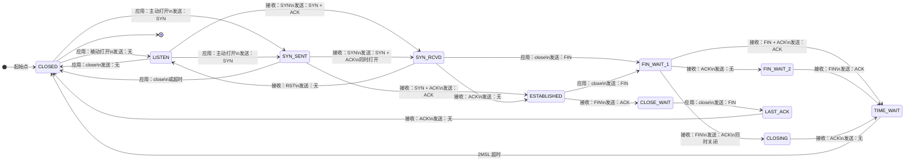

# TCP状态转换图

TCP 状态转换图描述的是一个 TCP 连接从 `CLOSED` 开始，经过建立连接、数据传输、关闭连接，再回到 `CLOSED` 的完整状态变化。它是理解 [[linux网络编程/概念词条/TCP三次握手|TCP三次握手]]、[[linux网络编程/概念词条/TCP四次挥手|TCP四次挥手]] 和 [[linux网络编程/概念词条/TCP通信时序与代码对应关系|TCP通信时序与代码对应关系]] 的核心图。

## 状态转换图

> [!tip] 放大查看
> 下面先嵌入一张可放大的 SVG 原图。若在 Obsidian 页面里仍觉得小，可以点击 [[attachments/tcp-state-transition.svg|打开 TCP 状态转换 SVG 原图]]，或[[tcpstate.png]]在单独标签页/系统图片查看器里缩放。

![[attachments/tcp-state-transition.svg|1200]]

## Mermaid 备用图

> [!note]
> Mermaid 图适合快速编辑，但复杂状态图在 Obsidian 中可能偏小；上面的 SVG 更适合复习时放大查看。



## 最常见路径：客户端主动连接并主动关闭

```text
CLOSED
  -> SYN_SENT
  -> ESTABLISHED
  -> FIN_WAIT_1
  -> FIN_WAIT_2
  -> TIME_WAIT
  -> CLOSED
```

这通常对应客户端代码：

```c
fd = socket(...);
connect(fd, ...);
write(fd, ...);
read(fd, ...);
close(fd);
```

## 最常见路径：服务器被动监听并被动关闭

```text
CLOSED
  -> LISTEN
  -> SYN_RCVD
  -> ESTABLISHED
  -> CLOSE_WAIT
  -> LAST_ACK
  -> CLOSED
```

这通常对应服务器代码：

```c
listenfd = socket(...);
bind(listenfd, ...);
listen(listenfd, ...);
connfd = accept(listenfd, ...);
read(connfd, ...);    // 对端关闭时返回 0
close(connfd);
```

## 状态含义表

| 状态            | 含义                                                  | 常见出现位置                                                       |
| ------------- | --------------------------------------------------- | ------------------------------------------------------------ |
| `CLOSED`      | 没有连接，起始状态或连接彻底释放后的状态。                               | 程序创建 socket 前，或连接关闭完成后。                                      |
| `LISTEN`      | 服务器正在监听连接请求。                                        | 服务器调用 [[linux网络编程/函数笔记/Socket/listen]] 后。                    |
| `SYN_SENT`    | 客户端已经发送 `SYN`，正在等待服务器的 `SYN + ACK`。                 | 客户端调用 [[linux网络编程/函数笔记/Socket/connect]] 后。                   |
| `SYN_RCVD`    | 服务器收到 `SYN`，已经回复 `SYN + ACK`，正在等待最后的 `ACK`。         | 三次握手第二步后。                                                    |
| `ESTABLISHED` | 连接已经建立，可以双向收发数据。                                    | `connect` 成功、[[linux网络编程/函数笔记/Socket/accept]] 返回后。           |
| `FIN_WAIT_1`  | 主动关闭方发送 `FIN` 后，等待对方确认。                             | 主动关闭方调用 `close` 或 [[linux网络编程/函数笔记/Socket/shutdown]] 关闭写方向后。 |
| `FIN_WAIT_2`  | 主动关闭方收到对 `FIN` 的 `ACK`，等待对方也发送 `FIN`。               | 主动关闭方等待对方关闭。也被视为[[TCP半关闭]]                                   |
| `CLOSE_WAIT`  | 被动关闭方收到对方 `FIN` 并回复 `ACK`，等待本地应用调用 `close`。         | `read/recv` 返回 `0` 后但程序还没关闭 fd。                              |
| `LAST_ACK`    | 被动关闭方已经发送 `FIN`，等待主动关闭方最后的 `ACK`。                   | 被动关闭方调用 `close` 后。                                           |
| `CLOSING`     | 双方几乎同时关闭，都发出了 `FIN`，正在等待确认。                         | 同时关闭的少见情况。                                                   |
| `TIME_WAIT`   | 主动关闭方发送最后 ACK 后等待 [[linux网络编程/概念词条/MSL]]，通常记为 2MSL。 | 主动关闭方关闭连接后的短暂保留状态。                                           |

## 三次握手对应的状态变化

- 客户端：`CLOSED -> SYN_SENT -> ESTABLISHED`。
- 服务器：`CLOSED -> LISTEN -> SYN_RCVD -> ESTABLISHED`。
- 对应报文：`SYN -> SYN + ACK -> ACK`。
- 详细过程见 [[linux网络编程/概念词条/TCP三次握手|TCP三次握手]]。

## 四次挥手对应的状态变化

- 主动关闭方：`ESTABLISHED -> FIN_WAIT_1 -> FIN_WAIT_2 -> TIME_WAIT -> CLOSED`。
- 被动关闭方：`ESTABLISHED -> CLOSE_WAIT -> LAST_ACK -> CLOSED`。
- 对应报文：`FIN -> ACK -> FIN -> ACK`。
- 详细过程见 [[linux网络编程/概念词条/TCP四次挥手|TCP四次挥手]]。

## 特殊路径

- **同时打开**：两端几乎同时主动打开，可能出现 `SYN_SENT -> SYN_RCVD -> ESTABLISHED`。
- **同时关闭**：两端几乎同时主动关闭，可能出现 `FIN_WAIT_1 -> CLOSING -> TIME_WAIT`。
- 如果主动关闭方在 `FIN_WAIT_1` 状态下收到对端的 `FIN + ACK`，会发送 `ACK` 并直接进入 `TIME_WAIT`，不是从 `TIME_WAIT` 回到 `FIN_WAIT_2`。
- `RST` 回退：如果连接请求被拒绝或异常复位，可能从 `SYN_RCVD` 回到 `LISTEN`，或直接终止连接。

## [[linux网络编程/概念词条/TIME_WAIT|TIME_WAIT]] 为什么存在

- 确保最后一个 `ACK` 如果丢失，对方重发 `FIN` 时还能再次回复。
- 让旧连接中的延迟报文在网络中自然过期，避免影响后续相同四元组的新连接。
- `TIME_WAIT` 通常出现在主动关闭连接的一方。
- `TIME_WAIT` 的等待时间通常按 [[linux网络编程/概念词条/MSL|2MSL]] 理解。

## 和 socket 代码的关系

- [[linux网络编程/函数笔记/Socket/listen|listen]] 后，服务器进入 `LISTEN`。
- [[linux网络编程/函数笔记/Socket/connect|connect]] 期间，客户端通常经历 `SYN_SENT`。
- [[linux网络编程/函数笔记/Socket/accept|accept]] 返回后，服务器侧连接已经进入 `ESTABLISHED`。
- [[linux网络编程/函数笔记/Socket/shutdown|shutdown]] 关闭写方向时，会触发 FIN，但本端仍可继续读，这对应 [[linux网络编程/概念词条/TCP半关闭|TCP半关闭]]。
- `read/recv` 返回 `0` 时，本端通常处于被动关闭路径，后续应调用 `close` 释放 fd。
- 主动调用 `close` 的一方通常会经历 `FIN_WAIT_1`、`FIN_WAIT_2`、`TIME_WAIT`。

## 易错点

- TCP 状态是内核协议栈维护的，不是应用程序自己设置的变量。
- `LISTEN` 属于监听 socket；`ESTABLISHED`、`CLOSE_WAIT`、`FIN_WAIT_*` 等通常属于已连接 socket。
- `CLOSE_WAIT` 长时间存在，常见原因是应用层读到对端关闭后没有及时 `close`。
- `TIME_WAIT` 是正常状态，不是连接泄漏；但大量 `TIME_WAIT` 需要结合连接模型和端口复用策略分析。
- TCP **同时打开**是指通信双方几乎同时主动向对方发送 SYN，
	双方从 SYN_SENT 收到对方 SYN 后进入 SYN_RECV
- FIN_WAIT_1 变为 CLOSING，发生在**同时关闭**（simultaneous close）场景中：
	主动关闭方在尚未收到对端 ACK 的情况下，先收到了对端的 FIN，
	TCP 进入 CLOSING 状态，待收到 ACK 后转入 TIME_WAIT。
- 当客户端处于 SYN_SENT 状态时，收到服务器的 SYN + ACK 报文，
	会回复 ACK 并进入 SYN_RECV 状态，（但这个时间极短）
	**等 ACK 发送完成后，才最终进入 ESTABLISHED 状态**

## 相关概念

- [[linux网络编程/概念词条/TCP|TCP]]
- [[linux网络编程/概念词条/TCP通信流程|TCP通信流程]]
- [[linux网络编程/概念词条/TCP通信时序与代码对应关系|TCP通信时序与代码对应关系]]
- [[linux网络编程/概念词条/TCP三次握手|TCP三次握手]]
- [[linux网络编程/概念词条/TCP四次挥手|TCP四次挥手]]
- [[linux网络编程/概念词条/MSL|MSL]]
- [[linux网络编程/概念词条/TIME_WAIT|TIME_WAIT]]
- [[linux网络编程/概念词条/TCP半关闭|TCP半关闭]]
- [[linux网络编程/概念词条/监听套接字|监听套接字]]
- [[linux网络编程/概念词条/已连接套接字|已连接套接字]]

## 相关函数

- [[linux网络编程/函数笔记/Socket/socket|socket]]
- [[linux网络编程/函数笔记/Socket/bind|bind]]
- [[linux网络编程/函数笔记/Socket/listen|listen]]
- [[linux网络编程/函数笔记/Socket/accept|accept]]
- [[linux网络编程/函数笔记/Socket/connect|connect]]
- [[linux网络编程/函数笔记/Socket/recv|recv]]
- [[linux网络编程/函数笔记/Socket/send|send]]

## 相关课时

- [[linux网络编程/课时笔记/03 TCP通信与通信案例/01 TCP通信基础案例|01 TCP通信基础案例]]
- [[linux网络编程/课时笔记/03 TCP通信与通信案例/02 客户端与服务器通信流程|02 客户端与服务器通信流程]]

## 相关模块

- [[linux网络编程/03 TCP通信与通信案例|03 TCP通信与通信案例]]
