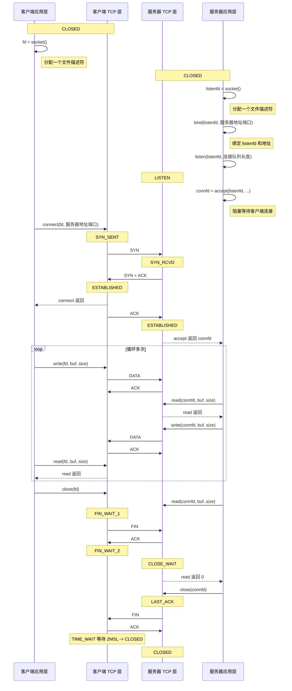

# TCP通信时序与代码对应关系

这张笔记用来把 TCP 客户端代码、服务器代码、[[linux网络编程/概念词条/TCP三次握手|TCP三次握手]]、数据收发、[[linux网络编程/概念词条/TCP四次挥手|TCP四次挥手]] 和 TCP 状态变化放在同一条时间线上理解。[[tcp.png]]

如果想看更完整的 TCP 状态机，包括同时打开、同时关闭、`CLOSING` 等少见路径，见 [[linux网络编程/概念词条/TCP状态转换图|TCP状态转换图]]。

## 总体时序图



## 代码与状态对应表

| 阶段           | 客户端代码                       | 客户端 TCP 状态    | 网络报文        | 服务器 TCP 状态    | 服务器代码                       | 说明                                     |
| ------------ | --------------------------- | ------------- | ----------- | ------------- | --------------------------- | -------------------------------------- |
| 创建客户端 socket | `fd = socket()`             | `CLOSED`      | 无           | `CLOSED`      | `listenfd = socket()`       | 双方只是创建文件描述符，还没有网络通信。                   |
| 绑定服务器地址      | 无                           | `CLOSED`      | 无           | `CLOSED`      | `bind(listenfd, ...)`       | 服务器把监听 socket 和本地 IP、端口绑定。             |
| 进入监听         | 无                           | `CLOSED`      | 无           | `LISTEN`      | `listen(listenfd, backlog)` | 服务器进入监听状态，准备接收连接。                      |
| 等待连接         | 无                           | `CLOSED`      | 无           | `LISTEN`      | `accept(listenfd, ...)` 阻塞  | `accept` 会等待客户端连接。                     |
| 第一次握手        | `connect(fd, ...)`          | `SYN_SENT`    | `SYN`       | `SYN_RCVD`    | `accept` 仍在等待               | 客户端主动发起连接。                             |
| 第二次握手        | `connect` 返回                | `SYN_SENT`    | `SYN + ACK` | `SYN_RCVD`    | `accept` 仍在等待               | 服务器确认客户端请求，同时发送自己的初始序号。                |
| 第三次握手        | 无                           | `ESTABLISHED` | `ACK`       | `ESTABLISHED` | `accept` 返回 `connfd`        | 三次握手完成，连接建立。                           |
| 连接建立完成       | 无                           | `ESTABLISHED` | 无           | `ESTABLISHED` | 无                           | 客户端 `fd` 和服务器 `connfd` 形成一条已连接 TCP 通道。 |
| 客户端发送        | `write(fd, buf, size)`      | `ESTABLISHED` | `DATA`      | `ESTABLISHED` | `read(connfd, buf, size)`   | 客户端应用层写入的数据由内核封装成 TCP 数据报文。            |
| 服务器确认        | 无                           | `ESTABLISHED` | `ACK`       | `ESTABLISHED` | `read` 返回                   | ACK 由 TCP 协议栈处理，不需要应用层手写。              |
| 服务器发送        | `read(fd, buf, size)` 阻塞或等待 | `ESTABLISHED` | `DATA`      | `ESTABLISHED` | `write(connfd, buf, size)`  | 服务器把处理结果发回客户端。                         |
| 客户端确认        | `read` 返回                   | `ESTABLISHED` | `ACK`       | `ESTABLISHED` | 无                           | 客户端收到数据后，内核发送 ACK。                     |
| 客户端主动关闭      | `close(fd)`                 | `FIN_WAIT_1`  | `FIN`       | `CLOSE_WAIT`  | `read(connfd, ...)`         | 客户端表示自己不再发送数据。                         |
| 服务器确认关闭请求    | 无                           | `FIN_WAIT_2`  | `ACK`       | `CLOSE_WAIT`  | `read` 返回 `0`               | 服务器应用层读到 `0`，表示客户端正常关闭发送方向。            |
| 服务器关闭        | 无                           | `FIN_WAIT_2`  | `FIN`       | `LAST_ACK`    | `close(connfd)`             | 服务器也关闭连接，发送 FIN。                       |
| 客户端最终确认      | 无                           | `TIME_WAIT`   | `ACK`       | `CLOSED`      | 无                           | 客户端发送最后 ACK，等待 [[linux网络编程/概念词条/MSL|2MSL]] 后进入 `CLOSED`。        |

## 客户端代码骨架

```c
int fd = socket(AF_INET, SOCK_STREAM, 0);

connect(fd, (struct sockaddr *)&serv_addr, sizeof(serv_addr));

while (1) {
    write(fd, buf, size);
    read(fd, buf, size);
}

close(fd);
```

## 服务器代码骨架

```c
int listenfd = socket(AF_INET, SOCK_STREAM, 0);

bind(listenfd, (struct sockaddr *)&serv_addr, sizeof(serv_addr));
listen(listenfd, 128);

int connfd = accept(listenfd, (struct sockaddr *)&client_addr, &client_len);

while (1) {
    int n = read(connfd, buf, sizeof(buf));
    if (n == 0) {
        break;
    }
    write(connfd, buf, n);
}

close(connfd);
close(listenfd);
```

## 按阶段理解

- 建立连接阶段：客户端的 [[linux网络编程/函数笔记/Socket/connect|connect]] 和服务器的 [[linux网络编程/函数笔记/Socket/accept|accept]] 背后对应 [[linux网络编程/概念词条/TCP三次握手|TCP三次握手]]。
- 数据传输阶段：双方都处于 `ESTABLISHED`，应用层只看到 `read/write` 或 [[linux网络编程/函数笔记/Socket/send|send]] / [[linux网络编程/函数笔记/Socket/recv|recv]]，真正的 `DATA`、`ACK` 由 TCP 协议栈处理。
- 关闭连接阶段：主动关闭方调用 `close` 后进入 `FIN_WAIT_1`，被动关闭方读到 `0` 后再关闭，整体对应 [[linux网络编程/概念词条/TCP四次挥手|TCP四次挥手]]。

## 易错点

- `accept` 返回前，服务器应用层还没有拿到真正用于通信的 `connfd`。
- **`read` 返回 `0` 不是读到了空字符串，而是对端正常关闭连接。**
- `ACK`、`SYN`、`FIN` 都是 TCP 协议栈处理的控制报文，普通 socket 程序不手写这些报文。
- 图中客户端主动关闭只是常见示例；实际中服务器也可以先主动关闭。
-  一旦 **收到 SYN + ACK**，连接状态变为 `ESTABLISHED`，`connect()`就返回 0
	第三次握手的 ACK 由内核 TCP 栈自动发送，与 `connect()`是否返回无关。

## 相关概念

- [[linux网络编程/概念词条/TCP|TCP]]
- [[linux网络编程/概念词条/TCP通信流程|TCP通信流程]]
- [[linux网络编程/概念词条/TCP三次握手|TCP三次握手]]
- [[linux网络编程/概念词条/TCP四次挥手|TCP四次挥手]]
- [[linux网络编程/概念词条/TCP数据包格式|TCP数据包格式]]
- [[linux网络编程/概念词条/TCP滑动窗口|TCP滑动窗口]]
- [[linux网络编程/概念词条/TCP状态转换图|TCP状态转换图]]
- [[linux网络编程/概念词条/MSL|MSL]]
- [[linux网络编程/概念词条/TIME_WAIT|TIME_WAIT]]
- [[linux网络编程/概念词条/监听套接字|监听套接字]]
- [[linux网络编程/概念词条/已连接套接字|已连接套接字]]

## 相关函数

- [[linux网络编程/函数笔记/Socket/socket|socket]]
- [[linux网络编程/函数笔记/Socket/bind|bind]]
- [[linux网络编程/函数笔记/Socket/listen|listen]]
- [[linux网络编程/函数笔记/Socket/accept|accept]]
- [[linux网络编程/函数笔记/Socket/connect|connect]]
- [[linux网络编程/函数笔记/Socket/send|send]]
- [[linux网络编程/函数笔记/Socket/recv|recv]]

## 相关课时

- [[linux网络编程/课时笔记/03 TCP通信与通信案例/01 TCP通信基础案例|01 TCP通信基础案例]]
- [[linux网络编程/课时笔记/03 TCP通信与通信案例/02 客户端与服务器通信流程|02 客户端与服务器通信流程]]

## 相关模块

- [[linux网络编程/03 TCP通信与通信案例|03 TCP通信与通信案例]]
