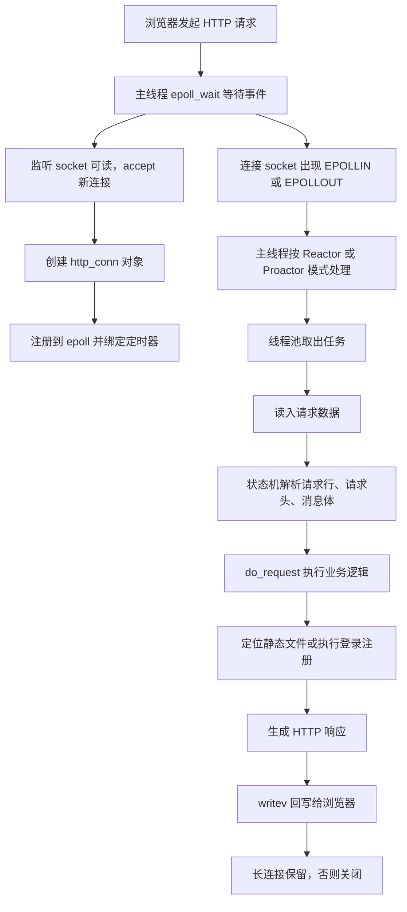

# 请求链路与从零实现

返回：[[TinyWebServer-面试拆解笔记]]

相关：[[TinyWebServer-拆解/01-项目总览与架构]]、[[TinyWebServer-拆解/04-http_conn与HTTP状态机]]、[[TinyWebServer-拆解/05-线程池与并发模型]]

## 一次 HTTP 请求怎么走

## 主线程负责什么

- `listen`
- `accept`
- `epoll_wait`
- 判断事件类型
- 把任务交给线程池
- 维护定时器
- 处理信号

## 工作线程负责什么

- 真正的连接处理
- 读写数据
- HTTP 报文解析
- 数据库访问
- 响应构造

## 为什么叫半同步半反应堆

- 反应堆部分：主线程监听 I/O 事件并分发
- 同步部分：工作线程同步处理业务逻辑

也就是说：

- 主线程不做重业务
- 工作线程负责真正处理请求

## 如果从零实现，顺序应该是什么

### 第 1 步：做最小可运行版本

先实现：

- `socket()`
- `bind()`
- `listen()`
- `accept()`
- `recv()`
- `send()`

目标不是高并发，而是先打通 HTTP 最小链路。

### 第 2 步：改成事件驱动

- 把阻塞 I/O 改成非阻塞
- 引入 `epoll`

### 第 3 步：抽象连接对象

- 用 `http_conn` 表示一个连接
- 把缓冲区、状态机、URL、连接状态都放到对象里

### 第 4 步：实现 HTTP 状态机

- 解析请求行
- 解析请求头
- 解析消息体

### 第 5 步：实现静态资源响应

- URL 映射文件
- `stat()`
- `mmap()`
- `writev()`

### 第 6 步：引入线程池

- 主线程只分发事件
- 工作线程处理请求

### 第 7 步：加定时器回收空闲连接

- 每个连接绑定定时器
- 超时自动关闭

### 第 8 步：加数据库连接池

- 启动时创建一批 MySQL 连接
- 请求时借用，用完归还

### 第 9 步：补上业务逻辑

- 注册
- 登录
- 页面跳转

### 第 10 步：补日志系统

- 记录运行状态
- 同步和异步写日志

## 面试里可以怎么说

> 如果让我从零实现这个项目，我会先做单线程最小 HTTP 服务，确认网络链路打通；然后引入非阻塞 I/O 和 epoll，把连接抽象成对象；接着实现 HTTP 状态机和静态文件返回；再加入线程池、定时器和数据库连接池，最后补注册登录和日志系统。这样做的好处是每一步都能独立验证，不会一开始把复杂度堆得太高。

