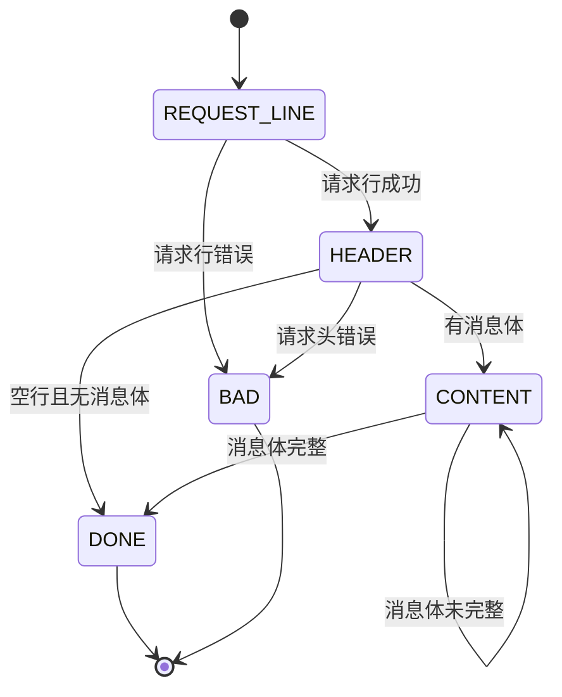

# http_conn与HTTP状态机

返回：[[TinyWebServer-面试拆解笔记]]

相关：[[TinyWebServer-拆解/02-请求链路与从零实现]]、[[TinyWebServer-拆解/03-入口与WebServer总控]]、[[TinyWebServer-拆解/07-数据库连接池与登录注册]]、[[TinyWebServer-拆解/10-HTTP请求报文解析与GETPOST流程]]

## `http_conn` 是干什么的

一句话：

`http_conn` 负责一条 HTTP 连接从读到写的全部细节。

它内部维护：

- socket fd
- 客户端地址
- 读缓冲区
- 写缓冲区
- 状态机状态
- URL
- Host
- Content-Length
- keep-alive 状态
- 目标文件信息
- `mmap` 文件地址
- `writev` 用到的 [[linux网络编程/概念词条/iovec|iovec]]

## 为什么必须用状态机

因为 TCP 是字节流，不保证一次 `recv()` 就能收到一个完整 HTTP 请求。

可能出现：

- 一次只收到半个请求头
- 一次收到多个请求
- 请求头和请求体分多次到达

所以要分阶段解析。

## 主状态机

- `CHECK_STATE_REQUESTLINE`
  解析请求行
- `CHECK_STATE_HEADER`
  解析请求头
- `CHECK_STATE_CONTENT`
  解析请求体

## 从状态机

从状态机负责按 `\r\n` 从缓冲区里切出完整的一行。

返回值有：

- `LINE_OK`
- `LINE_BAD`
- `LINE_OPEN`

## 状态转移图

## 关键函数

### `init(...)`

- 作用：初始化一个连接对象
- 会做这些事：
  - 保存 socket 和地址
  - 加入 epoll
  - 记录根目录
  - 保存数据库配置
  - 重置状态机

### `read_once()`

- 作用：从 socket 读数据到缓冲区
- LT 模式：读一次
- ET 模式：循环读到 `EAGAIN`

## 为什么 ET 模式一定要循环读

因为 ET 是边沿触发。  
如果这次事件来了但你没把数据读空，后续可能不会再收到新的读事件。

### `parse_line()`

- 作用：从缓冲区中切出一行
- 本质：为主状态机服务

### `parse_request_line(char *text)`

- 作用：解析请求行
- 解析出：
  - 请求方法
  - URL
  - HTTP 版本

### `parse_headers(char *text)`

- 作用：解析请求头
- 重点处理：
  - `Connection`
  - `Content-length`
  - `Host`

### `parse_content(char *text)`

- 作用：解析请求体
- 这个项目里主要用于 POST 表单

### `process_read()`

- 作用：HTTP 读状态机的总调度函数
- 顺序：
  - 切行
  - 解析请求行
  - 解析请求头
  - 解析请求体
  - 请求完整后调用 `do_request()`

### `do_request()`

- 作用：真正执行业务逻辑和定位文件

它做两类事：

#### 第一类：登录注册

- 解析用户名密码
- 注册时检查重名并插入数据库
- 登录时校验用户名密码

#### 第二类：URL 映射文件

- `/0` -> `register.html`
- `/1` -> `log.html`
- `/5` -> `picture.html`
- `/6` -> `video.html`
- `/7` -> `fans.html`
- 其他情况按 URL 拼接文件路径

之后：

- `stat()`
- `open()`
- `mmap()`

### `process_write(HTTP_CODE ret)`

- 作用：根据结果组织响应
- 会生成：
  - 状态行
  - 响应头
  - 响应体或文件内容

### `write()`

- 作用：发送响应
- 使用 [[linux网络编程/函数笔记/Socket/writev|writev]]()
- `[[linux网络编程/概念词条/iovec|iovec]][0]` 存响应头
- `[[linux网络编程/概念词条/iovec|iovec]][1]` 存文件内容

## 为什么用 `mmap + writev`

- `mmap`：减少文件读取拷贝
- [[linux网络编程/函数笔记/Socket/writev|writev]]：头和文件内容一次发送，减少系统调用

## keep-alive 怎么处理

如果请求头里有 `Connection: keep-alive`：

- 当前响应写完后不关闭连接
- 重置状态机
- 继续等待下一次请求

## 面试里可以怎么说

> `http_conn` 是项目最核心的模块，它把一个客户端连接抽象成对象，并维护这个连接的读写缓冲区、解析状态、URL、文件映射和响应构造逻辑。HTTP 报文解析采用主从状态机，因为 TCP 是流式协议，不能假设一次 recv 就读到完整请求。请求完整后，`do_request()` 会决定是返回静态文件还是执行注册登录逻辑，最后通过 `mmap + writev` 高效返回响应。

## 深入阅读

- [[TinyWebServer-拆解/10-HTTP请求报文解析与GETPOST流程]]
