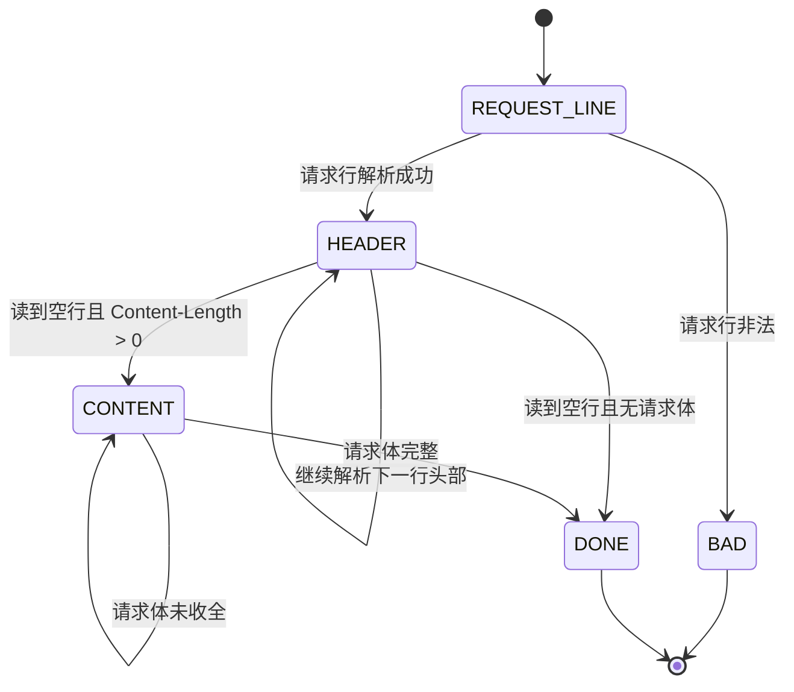

# HTTP请求报文解析与GETPOST流程

返回：[[TinyWebServer-面试拆解笔记]]

相关：[[TinyWebServer-拆解/04-http_conn与HTTP状态机]]、[[TinyWebServer-拆解/02-请求链路与从零实现]]、[[TinyWebServer-面试问答模拟版]]

> [!abstract]
> 这篇专门讲三件事：
> 1. HTTP 请求报文的结构是什么
> 2. 这个项目里 GET 和 POST 是怎么解析和处理的
> 3. 为什么不能假设一次 `recv()` 就拿到完整请求，以及项目是怎么解决“半包、粘包、分段到达”问题的

## 1. 先讲一个最核心的结论

HTTP 是应用层协议，但它通常跑在 TCP 上。  
TCP 是**字节流协议**，不是“报文边界协议”。

这句话非常关键，因为它直接决定了：

- 不能假设一次 `recv()` 就收到了完整 HTTP 请求
- 不能假设一次 `recv()` 只收到一个 HTTP 请求
- 也不能假设请求行、请求头、请求体会整整齐齐地一次到达

所以 HTTP 服务器一定要自己做解析，自己判断：

- 哪一行已经完整了
- 请求头有没有结束
- 请求体有没有收完
- 当前缓冲区里是一个请求还是多个请求

这也是这个项目为什么要用**主状态机 + 从状态机**。

## 2. HTTP 请求报文结构是什么

一个典型的 HTTP 请求报文一般由 4 部分组成：

1. 请求行
2. 请求头
3. 空行
4. 请求体

结构如下：

```text
请求行\r\n
请求头1\r\n
请求头2\r\n
...
\r\n
请求体
```

## 3. 请求行是什么

请求行格式是：

```text
<方法> <URL> <HTTP版本>\r\n
```

例如：

```text
GET /index.html HTTP/1.1\r\n
```

或者：

```text
POST /login HTTP/1.1\r\n
```

请求行主要提供三类信息：

- 方法
  - `GET`
  - `POST`
- URL
  - 访问的资源路径
- HTTP 版本
  - 例如 `HTTP/1.1`

在这个项目里，这部分由 `http_conn::parse_request_line(char *text)` 解析。

## 4. 请求头是什么

请求头是若干行 `key: value` 形式的数据。

例如：

```text
Host: 127.0.0.1:9006\r\n
Connection: keep-alive\r\n
Content-Length: 27\r\n
Content-Type: application/x-www-form-urlencoded\r\n
```

这个项目里重点处理了这些头：

- `Connection`
  决定是不是长连接
- `Content-length`
  决定请求体长度
- `Host`
  请求主机

这部分由 `http_conn::parse_headers(char *text)` 解析。

## 5. 空行的作用是什么

空行就是一个单独的 `\r\n`。  
它表示：

- 请求头结束了
- 后面如果还有内容，那就是请求体

所以解析时看到空行非常重要。

在这个项目里：

- 如果看到空行，而且 `Content-Length == 0`
  说明请求已经完整
- 如果看到空行，而且 `Content-Length > 0`
  说明接下来还要继续解析请求体

## 6. 请求体是什么

请求体通常用于提交数据，最常见的是 POST 表单。

例如浏览器提交登录表单时，请求体可能是：

```text
user=alice&passwd=123456
```

这个项目里 POST 请求体主要就是这种表单字符串，后面会在 `do_request()` 里进一步解析出用户名和密码。

## 7. GET 请求长什么样

一个典型 GET 请求可能是：

```text
GET /judge.html HTTP/1.1\r\n
Host: 127.0.0.1:9006\r\n
Connection: keep-alive\r\n
\r\n
```

特点：

- 一般没有请求体
- 主要是请求某个资源
- 参数常常放在 URL 里

在这个项目里，GET 最终通常走向：

- 返回某个 html 页面
- 返回图片
- 返回视频

## 8. POST 请求长什么样

一个典型 POST 请求可能是：

```text
POST /2CGISQL.cgi HTTP/1.1\r\n
Host: 127.0.0.1:9006\r\n
Content-Length: 27\r\n
Content-Type: application/x-www-form-urlencoded\r\n
Connection: keep-alive\r\n
\r\n
user=alice&passwd=123456
```

特点：

- 有请求体
- `Content-Length` 很关键
- 登录、注册这类提交型操作通常用 POST

在这个项目里，POST 主要用于：

- 登录
- 注册

## 9. GET 和 POST 在这个项目里怎么区分

在 `parse_request_line()` 里，项目会先解析请求方法：

- 如果是 `GET`
  就把 `m_method` 设为 `GET`
- 如果是 `POST`
  就把 `m_method` 设为 `POST`
  同时把 `cgi = 1`

这里的 `cgi = 1` 本质上是项目作者用来表示：

- 当前是一个需要进入表单业务逻辑的请求

也就是说，这个项目不是在做真正传统 CGI 程序，而是用这个标志来区分“是否是 POST 业务请求”。

## 10. 这个项目的 HTTP 解析为什么分两层状态机

因为它要解决两个不同层次的问题。

### 从状态机解决什么

从状态机只解决一个问题：

> 当前缓冲区里，能不能切出一整行？

它依据的是 `\r\n`。

返回值只有三种：

- `LINE_OK`
  这一行完整了
- `LINE_BAD`
  行格式错了
- `LINE_OPEN`
  这一行还没收完整

对应函数是：

- `http_conn::parse_line()`

### 主状态机解决什么

主状态机解决的问题是：

> 当前拿到的这一行，应该按请求行、请求头，还是请求体去解释？

主状态有三个：

- `CHECK_STATE_REQUESTLINE`
- `CHECK_STATE_HEADER`
- `CHECK_STATE_CONTENT`

对应调度函数是：

- `http_conn::process_read()`

## 11. 这套状态机怎么跑

完整逻辑可以这样理解：

1. 先从缓冲区里切行
2. 如果当前状态是“请求行”，就按请求行解析
3. 如果当前状态是“请求头”，就按请求头解析
4. 如果当前状态是“请求体”，就按消息体长度判断是否完整
5. 一旦请求完整，就进入 `do_request()`

可以画成这样：



## 12. 为什么不能假设一次 `recv()` 就拿到完整请求

因为 TCP 不保留应用层消息边界。

也就是说，下面这些情况都可能发生。

### 情况 1：一次只收到半个请求头

例如浏览器发的是：

```text
GET /index.html HTTP/1.1\r\n
Host: 127.0.0.1:9006\r\n
Connection: keep-alive\r\n
\r\n
```

但第一次 `recv()` 可能只收到：

```text
GET /index.html HTTP/1.1\r\n
Host: 127.0.0.1
```

这时候：

- 请求头第二行还不完整
- 不能贸然解析完毕
- 必须等下次继续收

### 情况 2：一次收到多个请求

如果是 keep-alive 长连接，客户端可能连续发多个请求。  
一次 `recv()` 可能收到：

```text
GET /a.html HTTP/1.1\r\n
Host: x\r\n
\r\n
GET /b.html HTTP/1.1\r\n
Host: x\r\n
\r\n
```

这就是典型的粘连。

### 情况 3：请求头和请求体分多次到达

例如一个 POST 请求：

第一次 `recv()` 可能只收到：

```text
POST /login HTTP/1.1\r\n
Host: x\r\n
Content-Length: 27\r\n
\r\n
user=ali
```

第二次才收到剩下的：

```text
ce&passwd=123456
```

这时虽然请求头已经完整，但请求体还没收全，仍然不能立刻处理。

## 13. 这个项目是怎么解决“半包、粘包、分段到达”的

注意，这里严格说更准确的叫法是：

- TCP 流式拆分
- 数据分段到达
- 多个请求粘连在同一缓冲区

项目的解决思路是：

### 第一层：先把数据读进缓冲区

函数：

- `http_conn::read_once()`

作用：

- 把 socket 中可读数据追加到 `m_read_buf`
- 用 `m_read_idx` 记录当前已经读到了哪里

这一步不会假设“这次读完就完整”。

### 第二层：从缓冲区里切行

函数：

- `http_conn::parse_line()`

作用：

- 从 `m_read_buf` 中寻找 `\r\n`
- 找到完整一行后，把 `\r\n` 改成字符串结束符 `\0\0`

这样后面的解析函数就能把每一行当成普通 C 字符串来处理。

### 第三层：按主状态机解析

函数：

- `http_conn::process_read()`

作用：

- 根据当前状态决定如何解释这一行

如果：

- 请求行还没完整，就继续等
- 请求头还没完整，就继续等
- 请求体还没到够 `Content-Length`，就继续等

只有完整了才进入下一步。

### 第四层：用 `Content-Length` 判断请求体是否完整

函数：

- `http_conn::parse_content(char *text)`

关键判断：

```text
m_read_idx >= m_content_length + m_checked_idx
```

意思是：

- 当前读到的总长度，是否已经覆盖了完整请求体

如果还不够：

- 返回 `NO_REQUEST`
- 继续等待下一批数据

### 第五层：请求不完整就重新监听读事件

在 `http_conn::process()` 里，如果 `process_read()` 返回 `NO_REQUEST`：

- 说明请求还没收完整
- 服务器不会误处理
- 而是重新注册 `EPOLLIN`
- 等待下次继续读

这就是它处理“半包”和“分段到达”的关键。

## 14. 这个项目是怎么处理 GET 的

GET 处理链路大致是：

1. `read_once()` 读入请求
2. `process_read()` 解析请求行和请求头
3. 方法被识别为 `GET`
4. 因为 GET 一般没有请求体，所以遇到空行后可直接认为请求完整
5. 调用 `do_request()`
6. 根据 URL 映射资源文件
7. `stat()` 检查文件
8. `mmap()` 文件
9. `process_write()` 组织响应头
10. `write()` 通过 `writev()` 回写

### 一个常见例子

如果访问：

```text
GET /judge.html HTTP/1.1
```

最后会把 `root/judge.html` 返回给浏览器。

## 15. 这个项目是怎么处理 POST 的

POST 处理链路大致是：

1. `read_once()` 读入请求
2. `process_read()` 解析请求行
3. 识别方法为 `POST`
4. `parse_headers()` 读出 `Content-Length`
5. 读到空行后切换到 `CHECK_STATE_CONTENT`
6. `parse_content()` 判断请求体是否收完整
7. 请求体完整后，调用 `do_request()`
8. 在 `do_request()` 里从表单字符串中提取用户名和密码
9. 根据 URL 判断是登录还是注册
10. 登录成功或失败后，把目标页面改成对应 html
11. 组织响应并回写

## 16. POST 表单在这个项目里怎么解析

项目里 POST 请求体格式类似：

```text
user=alice&passwd=123456
```

在 `do_request()` 中，它通过手工扫描字符串的方式提取：

- 用户名
- 密码

大致做法是：

1. 从 `user=` 后开始取用户名
2. 遇到 `&` 停止
3. 再跳过 `passwd=` 取密码

这是一种教学型写法，能说明思路，但工程上会更建议：

- 使用更健壮的表单解析工具
- 做 URL 解码
- 做边界校验

## 17. GET 和 POST 的差异，在这个项目里最该怎么讲

你可以这样讲：

> 在这个项目里，GET 主要用来请求静态资源，比如 html、图片和视频页面；POST 主要用来提交登录和注册表单。解析上二者都先走请求行和请求头状态机，但 GET 通常在空行处就能结束，而 POST 还要根据 `Content-Length` 继续解析请求体。也就是说，真正的区别不只是方法名不同，而是 POST 比 GET 多了一个“请求体完整性判断”的步骤。

## 18. 为什么这个项目没有被 TCP 分包问题搞乱

因为它不是“收到一次就处理一次”，而是：

- 把所有收到的数据先放进缓冲区
- 再按协议规则慢慢解析

具体靠的是：

- `m_read_buf`
  保存原始字节流
- `m_read_idx`
  表示已经读了多少字节
- `m_checked_idx`
  表示已经检查到哪里
- `m_start_line`
  表示当前行起始位置

这几个游标配合状态机，就能把字节流稳定地解析成 HTTP 请求。

## 19. 这套实现的优点

- 思路清晰，适合教学和面试讲解
- 能正确处理请求分段到达
- 能区分请求行、请求头和请求体
- 能支持 GET 和 POST 两类主要场景
- 配合 `EPOLLONESHOT`，避免同一连接被多个线程重复处理

## 20. 这套实现的局限

- 只实现了较基础的 HTTP/1.1 解析
- 对复杂头部支持有限
- POST 表单解析较原始
- 对 chunked 编码等高级情况没有支持
- 对多个请求粘在一个缓冲区后的更完整流水线处理并不算工业级

## 21. 面试里最推荐的一段回答

> HTTP 请求解析之所以不能简单靠一次 `recv()`，是因为 HTTP 虽然是报文协议，但底层跑在 TCP 上，而 TCP 是字节流协议，不保留应用层边界。所以可能出现一次只收到半个请求头、一次收到多个请求，或者请求头和请求体分多次到达。这个项目的解决方法是使用主从状态机：从状态机负责按 `\r\n` 从缓冲区里切出完整行，主状态机负责区分当前是在解析请求行、请求头还是请求体；对于 POST 请求，还会根据 `Content-Length` 判断请求体是否收完整。如果没收完整，就返回 `NO_REQUEST`，重新监听读事件，等下次数据到了继续解析。这样就能稳定处理 GET 和 POST 请求，而不会被 TCP 的流式传输特性干扰。

## 22. 你可以怎么复习这篇

如果时间很紧，优先记住这 5 句话：

1. HTTP 跑在 TCP 上，所以不能假设一次 `recv()` 就拿到完整请求。
2. 请求报文由请求行、请求头、空行、请求体组成。
3. GET 通常没有请求体，POST 通常要结合 `Content-Length` 解析请求体。
4. 项目用主从状态机解决半包、粘连和分段到达问题。
5. 请求不完整时不会误处理，而是返回 `NO_REQUEST`，等待下一次继续读。

