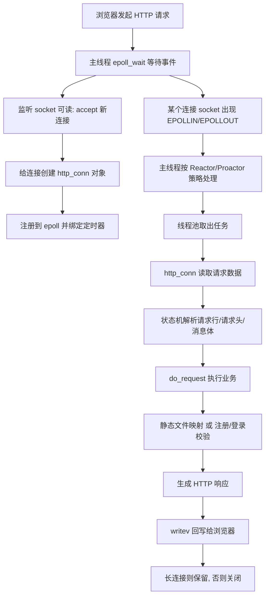

# TinyWebServer 面试拆解笔记

> [!abstract]
> 这份笔记的目标不是“看懂 README”，而是让你能在面试里把这个项目从头到尾讲明白：
> 1. 它实现了什么
> 2. 它为什么这样设计
> 3. 每个模块分别负责什么
> 4. 一次 HTTP 请求在代码里是怎么跑完的
> 5. 如果从零重新做这个项目，应该按什么顺序实现

## 1. 一句话先讲清这个项目

TinyWebServer 是一个运行在 Linux 上的轻量级 C++ Web 服务器。  
它基于 `socket + epoll + 线程池 + 非阻塞 I/O + 状态机` 来处理 HTTP 请求，并额外实现了：

- 静态资源访问
- 用户注册 / 登录
- MySQL 数据库连接池
- 超时连接回收
- 同步 / 异步日志
- Reactor / Proactor 两种并发处理思路

如果你要在面试里用 30 秒介绍它，可以直接说：

> 这是一个基于 Linux 高并发网络编程模型实现的轻量级 Web 服务器。主线程使用 `epoll` 监听连接和 I/O 事件，工作线程通过线程池处理业务逻辑；HTTP 请求解析采用状态机；数据库访问通过连接池复用 MySQL 连接；空闲连接通过定时器回收；日志支持同步和异步两种模式。项目同时提供 Reactor 和 Proactor 两种事件处理模型。

## 2. 这个项目到底实现了什么

### 2.1 用户能看到的功能

- 浏览器访问首页和静态页面
- 请求图片和视频文件
- 注册账号
- 登录账号
- 登录成功后进入欢迎页

### 2.2 面试官真正关心的功能

- 服务器如何监听端口并接收大量连接
- 如何把 I/O 事件分发给线程池
- 如何避免一个线程卡死整个服务
- 如何解析 HTTP 报文
- 如何把 URL 映射到本地文件
- 如何访问 MySQL 而不频繁创建连接
- 如何处理连接超时
- 如何写日志且不拖慢主流程

## 3. 整体架构图怎么对应到代码

你给的图可以直接映射成下面这几个源码模块：

- `main.cpp`
  负责程序入口
- `config.h / config.cpp`
  负责命令行参数解析
- `webserver.h / webserver.cpp`
  负责服务器总控，主线程、epoll、监听 socket、信号、定时器调度都在这里
- `http/http_conn.h / http_conn.cpp`
  负责单个 HTTP 连接的读、解析、业务处理、响应生成、写回
- `threadpool/threadpool.h`
  负责工作线程池和任务队列
- `timer/lst_timer.h / lst_timer.cpp`
  负责超时定时器和超时回收
- `CGImysql/sql_connection_pool.h / sql_connection_pool.cpp`
  负责 MySQL 连接池
- `log/log.h / log.cpp / block_queue.h`
  负责同步 / 异步日志
- `lock/locker.h`
  负责互斥锁、条件变量、信号量的简单封装
- `root/`
  负责网站静态资源

## 4. 整个请求链路怎么走

### 4.1 从浏览器发请求到服务器返回页面



### 4.2 主线程和工作线程分别干什么

主线程负责：

- `listen`
- `accept`
- `epoll_wait`
- 判断事件类型
- 把任务塞给线程池
- 维护定时器
- 处理信号

工作线程负责：

- 真正处理连接任务
- 读取或写出数据（Reactor 模式下）
- 解析 HTTP 报文
- 访问数据库
- 组织响应报文

### 4.3 这个项目的“半同步 / 半反应堆”是什么意思

这是一个经典的高并发服务器模型：

- “反应堆”部分：主线程监听 I/O 事件，看到有事件就分发
- “同步”部分：工作线程同步处理业务逻辑

也就是：

- 主线程不做重业务，只做事件分发
- 工作线程真正处理请求

这样做的好处是：

- 主线程很轻，能快速接收大量连接
- 工作线程只专注处理任务
- 结构清晰，便于扩展

## 5. 如果从零重新做这个项目，正确的实现顺序是什么

如果你明天被问“如果让你从零实现，你会怎么做”，建议按这个顺序回答。

### 第 1 步：先做最小可运行版服务器

目标：

- `socket()`
- `bind()`
- `listen()`
- `accept()`
- `recv()`
- `send()`

先不考虑线程池、不考虑数据库、不考虑 epoll。  
先做一个“单连接、单线程、收到请求后返回固定字符串”的 HTTP 服务器。

你可以说：

> 我会先验证协议链路是否打通，也就是先让浏览器能访问到一个最简单的 HTTP 响应，比如返回一个固定 HTML 页面。

### 第 2 步：改成并发事件驱动

目标：

- 把阻塞 I/O 改成非阻塞
- 用 `epoll` 统一监听多个连接

原因：

- 如果还用阻塞 `accept/recv`，一个慢连接就可能拖慢整个服务
- `epoll` 更适合高并发场景

### 第 3 步：引入连接对象

目标：

- 用 `http_conn` 表示“一个客户端连接”
- 把每个连接相关的数据放到对象里

比如：

- socket fd
- 读缓冲区
- 写缓冲区
- 解析状态
- 当前 URL
- keep-alive 状态

这样主线程只需要根据 `sockfd` 找到对应的 `http_conn` 对象。

### 第 4 步：实现 HTTP 请求解析状态机

目标：

- 解析请求行
- 解析请求头
- 解析消息体

这是项目的核心之一。  
因为 TCP 是字节流，不保证一次 `recv()` 就能读到完整请求，所以必须做状态机。

### 第 5 步：实现静态资源响应

目标：

- 把 URL 映射成本地文件路径
- 用 `stat()` 判断文件是否存在
- 用 `mmap()` 把文件映射到内存
- 用 `writev()` 把“响应头 + 文件内容”一起发给客户端

### 第 6 步：实现线程池

目标：

- 主线程只负责分发事件
- 工作线程处理请求

原因：

- 否则主线程既监听又做业务，很快会成为瓶颈

### 第 7 步：实现超时连接回收

目标：

- 每个连接绑定定时器
- 定时检查连接是否长时间无活动
- 超时自动关闭

原因：

- 防止大量“连上但不发数据”的死连接把资源占满

### 第 8 步：实现数据库连接池

目标：

- 启动时预创建一批 MySQL 连接
- 请求来了直接借用连接
- 用完归还

原因：

- 避免每次注册 / 登录都临时建库连接，性能和稳定性都更好

### 第 9 步：实现业务逻辑

目标：

- 注册
- 登录
- 页面跳转

这个项目里业务逻辑很轻，核心还是网络和并发模型。

### 第 10 步：补充日志系统

目标：

- 记录运行状态
- 排查错误
- 可选同步 / 异步写日志

## 6. 入口模块详解：`main.cpp` + `config.*`

### 6.1 `main.cpp` 在做什么

源码入口：`main.cpp:3`

主流程非常清晰：

1. 设置数据库用户名、密码、库名
2. 创建 `Config`，解析命令行参数
3. 创建 `WebServer`
4. 调用 `init()`
5. 初始化日志
6. 初始化数据库连接池
7. 初始化线程池
8. 设置触发模式
9. 建立监听和 epoll
10. 进入事件循环

你可以把 `main` 理解为“总装配流程”。

### 6.2 `Config` 模块作用

作用：解析命令行参数，决定服务器运行方式。

#### `Config::Config()`

- 位置：`config.cpp:3`
- 作用：给所有配置项设置默认值
- 输入：无
- 输出：无

默认项包括：

- 端口 `9006`
- 日志默认同步
- 默认 `LT + LT`
- 默认不开启优雅关闭
- 数据库连接池大小 `8`
- 线程池线程数 `8`
- 默认不关闭日志
- 默认并发模型为 `Proactor`

#### `Config::parse_arg(int argc, char *argv[])`

- 位置：`config.cpp:35`
- 作用：解析命令行选项
- 输入：
  - `argc`：参数个数
  - `argv`：参数数组
- 输出：无，直接修改 `Config` 对象成员

支持的参数：

- `-p`：端口
- `-l`：日志写入方式
- `-m`：触发模式组合
- `-o`：是否启用优雅关闭
- `-s`：数据库连接数
- `-t`：线程数
- `-c`：是否关闭日志
- `-a`：并发模型，`0` 是 Proactor，`1` 是 Reactor

## 7. 服务器总控模块：`WebServer`

这个类是项目的“大脑”。

### 7.1 重要成员变量

- `m_port`
  监听端口
- `m_root`
  网站根目录，默认是当前目录下的 `root`
- `m_epollfd`
  epoll 实例
- `m_listenfd`
  监听 socket
- `users`
  `http_conn` 对象数组，每个 fd 对应一个连接对象
- `users_timer`
  定时器相关数据数组
- `m_pool`
  线程池
- `m_connPool`
  数据库连接池
- `m_pipefd`
  用于把信号转换成普通 fd 事件的管道

### 7.2 为什么 `users` 和 `users_timer` 要开成大数组

因为 Linux 的 socket fd 本身就是整数。  
作者直接用 `fd` 当数组下标：

- `users[connfd]`
- `users_timer[connfd]`

优点：

- 查找快，O(1)
- 不需要额外 map

缺点：

- 预分配空间比较大

### 7.3 主要函数逐个讲

#### `WebServer::WebServer()`

- 位置：`webserver.cpp:3`
- 作用：
  - 申请 `users` 数组
  - 计算网站根目录 `m_root`
  - 申请 `users_timer` 数组
- 输入：无
- 输出：无

#### `WebServer::~WebServer()`

- 位置：`webserver.cpp:20`
- 作用：释放 epoll、监听 fd、管道、连接数组、定时器数组、线程池
- 输入：无
- 输出：无

#### `WebServer::init(...)`

- 位置：`webserver.cpp:31`
- 作用：保存服务器配置
- 输入：
  - `port`：端口
  - `user/passWord/databaseName`：数据库配置
  - `log_write`：日志模式
  - `opt_linger`：是否优雅关闭
  - `trigmode`：LT/ET 组合
  - `sql_num`：数据库连接池连接数
  - `thread_num`：线程数
  - `close_log`：是否关闭日志
  - `actor_model`：Reactor / Proactor
- 输出：无

这个函数只做“记录参数”，不做真正的网络初始化。

#### `WebServer::trig_mode()`

- 位置：`webserver.cpp:47`
- 作用：根据 `m_TRIGMode` 设置监听 socket 和连接 socket 的触发模式
- 输入：无
- 输出：无

四种组合：

- `0`：LT + LT
- `1`：LT + ET
- `2`：ET + LT
- `3`：ET + ET

#### `WebServer::log_write()`

- 位置：`webserver.cpp:75`
- 作用：初始化日志系统
- 输入：无
- 输出：无

逻辑：

- 如果不关闭日志：
  - `m_log_write == 1`，初始化异步日志
  - 否则初始化同步日志

#### `WebServer::sql_pool()`

- 位置：`webserver.cpp:87`
- 作用：
  - 初始化数据库连接池
  - 把用户表中的账号密码读入内存 map
- 输入：无
- 输出：无

注意：

- `users->initmysql_result(m_connPool)` 虽然写的是 `users->`，本质上是调用 `http_conn` 类的方法把数据库中的账号密码加载到全局 `users` map 里

#### `WebServer::thread_pool()`

- 位置：`webserver.cpp:97`
- 作用：创建线程池
- 输入：无
- 输出：无

#### `WebServer::eventListen()`

- 位置：`webserver.cpp:103`
- 作用：完成网络初始化和 epoll 初始化
- 输入：无
- 输出：无

这个函数非常重要，做了以下事：

1. `socket()` 创建监听 socket
2. 根据 `m_OPT_LINGER` 设置 `SO_LINGER`
3. 绑定地址 `bind()`
4. 开始监听 `listen()`
5. 初始化工具类和超时时间
6. 创建 epoll 实例
7. 把监听 fd 加入 epoll
8. 创建 `socketpair()`，把信号转成普通 I/O 事件
9. 注册 `SIGPIPE`、`SIGALRM`、`SIGTERM`
10. 启动第一次 `alarm()`

面试很爱问：为什么要用 `socketpair + 信号处理`？

答法：

> 因为信号是异步的，不适合直接在信号处理函数里做复杂逻辑，所以把信号写进管道，主线程在 epoll 里统一处理，这样就把“异步信号”转成了“同步 I/O 事件”。

#### `WebServer::timer(int connfd, sockaddr_in client_address)`

- 位置：`webserver.cpp:161`
- 作用：
  - 初始化新连接对应的 `http_conn`
  - 创建并绑定一个定时器
- 输入：
  - `connfd`：连接 fd
  - `client_address`：客户端地址
- 输出：无

连接默认超时时间是 `3 * TIMESLOT`。

#### `WebServer::adjust_timer(util_timer *timer)`

- 位置：`webserver.cpp:180`
- 作用：连接有活动时，延长超时时间
- 输入：
  - `timer`：待调整的定时器
- 输出：无

#### `WebServer::deal_timer(util_timer *timer, int sockfd)`

- 位置：`webserver.cpp:189`
- 作用：
  - 执行定时器回调关闭连接
  - 从定时器链表删除定时器
- 输入：
  - `timer`：定时器对象
  - `sockfd`：连接 fd
- 输出：无

#### `WebServer::dealclientdata()`

- 位置：`webserver.cpp:200`
- 作用：处理新客户端连接
- 输入：无
- 输出：
  - `true`：成功接收连接
  - `false`：失败或 ET 模式下本轮接收结束

分两种情况：

- LT 模式：一次 `accept()` 一个连接
- ET 模式：循环 `accept()`，直到没有新连接

#### `WebServer::dealwithsignal(bool &timeout, bool &stop_server)`

- 位置：`webserver.cpp:244`
- 作用：读取信号管道中的信号并转成业务标志位
- 输入：
  - `timeout`：是否发生定时器事件
  - `stop_server`：是否需要停止服务器
- 输出：
  - `true`：处理成功
  - `false`：读取失败

#### `WebServer::dealwithread(int sockfd)`

- 位置：`webserver.cpp:280`
- 作用：处理可读事件
- 输入：
  - `sockfd`：就绪连接 fd
- 输出：无

这是 Reactor / Proactor 差异的关键函数。

在 Reactor 模式下：

- 主线程只把“读任务”扔进线程池
- 工作线程再去 `read_once()`

在 Proactor 模式下：

- 主线程先自己读数据 `read_once()`
- 读成功后把“处理任务”交给线程池

#### `WebServer::dealwithwrite(int sockfd)`

- 位置：`webserver.cpp:331`
- 作用：处理可写事件
- 输入：
  - `sockfd`：就绪连接 fd
- 输出：无

在 Reactor 模式下：

- 主线程把“写任务”交给线程池

在 Proactor 模式下：

- 主线程直接调用 `write()`

#### `WebServer::eventLoop()`

- 位置：`webserver.cpp:377`
- 作用：服务器主事件循环
- 输入：无
- 输出：无

循环逻辑：

1. `epoll_wait()`
2. 遍历所有就绪事件
3. 如果是监听 fd，接收新连接
4. 如果是异常事件，关闭连接
5. 如果是信号管道，处理信号
6. 如果是读事件，走读逻辑
7. 如果是写事件，走写逻辑
8. 如果超时标志被置位，执行定时器检查

这个函数就是整个服务器“活着运行”的地方。

## 8. HTTP 连接模块：`http_conn`

这是项目最核心的模块。  
一句话：`http_conn` 负责“一条 HTTP 连接从读到写的全部细节”。

### 8.1 这个类维护了哪些状态

- 当前连接 fd
- 客户端地址
- 读缓冲区
- 写缓冲区
- 当前解析位置
- 当前状态机状态
- 请求方法
- URL
- Host
- Content-Length
- 是否 keep-alive
- 目标文件信息
- `mmap` 后的文件地址
- `writev` 使用的 `iovec`
- 当前是否是 CGI 业务（这里其实是注册 / 登录逻辑）

### 8.2 状态机枚举说明

#### 请求方法 `METHOD`

- `GET`
- `POST`
- 其他方法虽然枚举里有，但真正实现只处理了 `GET` 和 `POST`

#### 主状态机 `CHECK_STATE`

- `CHECK_STATE_REQUESTLINE`
  正在解析请求行
- `CHECK_STATE_HEADER`
  正在解析请求头
- `CHECK_STATE_CONTENT`
  正在解析请求体

#### 解析结果 `HTTP_CODE`

- `NO_REQUEST`
  请求还没接收完整
- `GET_REQUEST`
  已拿到完整请求
- `BAD_REQUEST`
  错误请求
- `NO_RESOURCE`
  资源不存在
- `FORBIDDEN_REQUEST`
  没权限
- `FILE_REQUEST`
  文件请求成功
- `INTERNAL_ERROR`
  服务器内部错误
- `CLOSED_CONNECTION`
  连接关闭

#### 行解析结果 `LINE_STATUS`

- `LINE_OK`
  一行完整
- `LINE_BAD`
  行格式错误
- `LINE_OPEN`
  这一行还没收完整

### 8.3 `http_conn` 关键函数

#### `initmysql_result(connection_pool *connPool)`

- 位置：`http_conn.cpp:20`
- 作用：启动时把数据库 `user` 表中的账号密码加载到内存 map
- 输入：
  - `connPool`：数据库连接池
- 输出：无

流程：

1. 从连接池取一个 MySQL 连接
2. 执行 `SELECT username, passwd FROM user`
3. 把结果逐行读出来
4. 存进全局 `map<string, string> users`

这样登录时可以先在内存里查，不必每次都查数据库。

#### `setnonblocking(int fd)`

- 位置：`http_conn.cpp:51`
- 作用：把 fd 设置为非阻塞
- 输入：
  - `fd`：文件描述符
- 输出：
  - 旧的文件状态标志

#### `addfd(int epollfd, int fd, bool one_shot, int TRIGMode)`

- 位置：`http_conn.cpp:60`
- 作用：把连接 fd 注册到 epoll，并根据需要设置 `EPOLLONESHOT`
- 输入：
  - `epollfd`
  - `fd`
  - `one_shot`
  - `TRIGMode`
- 输出：无

#### `removefd(int epollfd, int fd)`

- 位置：`http_conn.cpp:77`
- 作用：把 fd 从 epoll 删除并关闭
- 输入：
  - `epollfd`
  - `fd`
- 输出：无

#### `modfd(int epollfd, int fd, int ev, int TRIGMode)`

- 位置：`http_conn.cpp:84`
- 作用：修改 fd 的 epoll 监听事件，一般用于读写切换后重新激活 `EPOLLONESHOT`
- 输入：
  - `epollfd`
  - `fd`
  - `ev`：新的事件类型
  - `TRIGMode`
- 输出：无

#### `close_conn(bool real_close = true)`

- 位置：`http_conn.cpp:101`
- 作用：关闭连接并从 epoll 删除
- 输入：
  - `real_close`：是否真正关闭
- 输出：无

#### `init(int sockfd, const sockaddr_in &addr, char *root, int TRIGMode, int close_log, string user, string passwd, string sqlname)`

- 位置：`http_conn.cpp:113`
- 作用：初始化一个连接对象
- 输入：
  - `sockfd`：连接 fd
  - `addr`：客户端地址
  - `root`：网站根目录
  - `TRIGMode`：触发模式
  - `close_log`：是否关闭日志
  - `user/passwd/sqlname`：数据库认证信息
- 输出：无

它会：

- 保存连接信息
- 把连接加入 epoll
- 记录根目录
- 保存数据库配置
- 调用内部 `init()` 重置状态机

#### `init()`

- 位置：`http_conn.cpp:136`
- 作用：重置当前连接的解析和响应状态
- 输入：无
- 输出：无

这个函数在两种场景会被调用：

- 新连接初始化
- keep-alive 场景下，一次请求处理完后重置，等待下一个请求

#### `parse_line()`

- 位置：`http_conn.cpp:164`
- 作用：从读缓冲区中解析一行，以 `\r\n` 为边界
- 输入：无，直接使用成员缓冲区
- 输出：
  - `LINE_OK`
  - `LINE_BAD`
  - `LINE_OPEN`

这是“从字节流拆出 HTTP 行”的基础。

#### `read_once()`

- 位置：`http_conn.cpp:198`
- 作用：从 socket 读取数据到读缓冲区
- 输入：无
- 输出：
  - `true`：读取成功
  - `false`：连接关闭或出错

注意：

- LT 模式下只读一次
- ET 模式下会循环读，直到 `EAGAIN`

面试很可能问：为什么 ET 要循环读？

答：

> 因为 ET 是边沿触发，状态只变化一次，如果不把数据一次性读空，后续可能收不到新的读事件。

#### `parse_request_line(char *text)`

- 位置：`http_conn.cpp:242`
- 作用：解析请求行，例如 `GET /index.html HTTP/1.1`
- 输入：
  - `text`：当前行字符串
- 输出：
  - `HTTP_CODE`

它会解析出：

- 请求方法
- URL
- HTTP 版本

然后把主状态切到 `CHECK_STATE_HEADER`。

#### `parse_headers(char *text)`

- 位置：`http_conn.cpp:290`
- 作用：解析请求头
- 输入：
  - `text`：请求头某一行
- 输出：
  - `HTTP_CODE`

它主要处理：

- `Connection`
- `Content-length`
- `Host`

如果遇到空行：

- 有消息体则进入 `CHECK_STATE_CONTENT`
- 没消息体则说明请求完整，返回 `GET_REQUEST`

#### `parse_content(char *text)`

- 位置：`http_conn.cpp:330`
- 作用：解析请求体
- 输入：
  - `text`：请求体起始位置
- 输出：
  - `HTTP_CODE`

对于本项目，POST 消息体主要用于表单提交，例如：

```text
user=xxx&passwd=yyy
```

#### `process_read()`

- 位置：`http_conn.cpp:342`
- 作用：HTTP 读状态机总调度函数
- 输入：无
- 输出：
  - `HTTP_CODE`

逻辑：

1. 先通过 `parse_line()` 一行一行切数据
2. 根据当前主状态：
   - 解析请求行
   - 解析请求头
   - 解析请求体
3. 当请求完整时，调用 `do_request()`

#### `do_request()`

- 位置：`http_conn.cpp:388`
- 作用：真正执行业务逻辑并定位资源文件
- 输入：无
- 输出：
  - `HTTP_CODE`

这是业务核心。

它做两类事：

##### 第一类：处理注册 / 登录

当是 `POST` 且 URL 符合业务约定时：

- `/2...` 表示登录校验
- `/3...` 表示注册校验

它会：

1. 从 POST 数据中提取用户名和密码
2. 如果是注册：
   - 先检查内存 map 是否重名
   - 不重名就执行 SQL `INSERT`
   - 成功跳转 `log.html`
   - 失败跳转 `registerError.html`
3. 如果是登录：
   - 在内存 map 中校验用户名密码
   - 成功跳转 `welcome.html`
   - 失败跳转 `logError.html`

##### 第二类：处理 URL 到文件的映射

例如：

- `/0` -> `register.html`
- `/1` -> `log.html`
- `/5` -> `picture.html`
- `/6` -> `video.html`
- `/7` -> `fans.html`
- 其他情况 -> 按 URL 拼接成真实文件路径

然后：

1. `stat()` 检查文件
2. 判断是否可读
3. 判断是否目录
4. `open()`
5. `mmap()` 到内存
6. 返回 `FILE_REQUEST`

#### `unmap()`

- 位置：`http_conn.cpp:516`
- 作用：解除文件内存映射
- 输入：无
- 输出：无

#### `write()`

- 位置：`http_conn.cpp:524`
- 作用：把响应写回客户端
- 输入：无
- 输出：
  - `true`：发送完成或暂时无法继续但连接仍有效
  - `false`：发送失败或需要关闭连接

实现要点：

- 使用 `writev()`
- `m_iv[0]` 放响应头
- `m_iv[1]` 放文件内容
- 处理部分写
- 写完后：
  - keep-alive 则重置状态继续等下一个请求
  - 否则关闭连接

#### `add_response(const char *format, ...)`

- 位置：`http_conn.cpp:581`
- 作用：往写缓冲区追加格式化文本
- 输入：
  - `format`：格式串
  - 可变参数：具体内容
- 输出：
  - `true`：写入成功
  - `false`：空间不足

#### `add_status_line(int status, const char *title)`

- 位置：`http_conn.cpp:600`
- 作用：追加响应状态行
- 输入：
  - `status`：状态码
  - `title`：状态描述
- 输出：`bool`

#### `add_headers(int content_len)`

- 位置：`http_conn.cpp:604`
- 作用：追加完整响应头
- 输入：
  - `content_len`：响应体长度
- 输出：`bool`

#### `add_content_length(int content_len)`

- 位置：`http_conn.cpp:609`
- 作用：追加 `Content-Length`
- 输入：
  - `content_len`：长度
- 输出：`bool`

#### `add_content_type()`

- 位置：`http_conn.cpp:613`
- 作用：追加 `Content-Type`
- 输入：无
- 输出：`bool`

注意：这个函数定义了，但在当前 `add_headers()` 里没有被调用。

#### `add_linger()`

- 位置：`http_conn.cpp:617`
- 作用：追加 `Connection: keep-alive/close`
- 输入：无
- 输出：`bool`

#### `add_blank_line()`

- 位置：`http_conn.cpp:621`
- 作用：在头部后追加空行
- 输入：无
- 输出：`bool`

#### `add_content(const char *content)`

- 位置：`http_conn.cpp:625`
- 作用：追加响应体文本
- 输入：
  - `content`：文本内容
- 输出：`bool`

#### `process_write(HTTP_CODE ret)`

- 位置：`http_conn.cpp:629`
- 作用：根据业务处理结果组织 HTTP 响应
- 输入：
  - `ret`：业务处理结果
- 输出：
  - `true`：响应构造成功
  - `false`：响应构造失败

它会根据不同结果生成：

- `500`
- `404`
- `403`
- `200`

并在 `FILE_REQUEST` 时配置 `iovec`，让后面 `writev()` 一次发送。

#### `process()`

- 位置：`http_conn.cpp:688`
- 作用：单个连接的总处理入口
- 输入：无
- 输出：无

流程：

1. `process_read()`
2. 如果请求还不完整，重新监听读事件
3. 否则 `process_write()`
4. 切换监听为写事件

## 9. 线程池模块：`threadpool`

这个模块负责把“连接处理任务”分发给多个工作线程。

### 9.1 线程池里有什么

- 一个工作线程数组 `m_threads`
- 一个任务队列 `m_workqueue`
- 一个互斥锁 `m_queuelocker`
- 一个信号量 `m_queuestat`
- 一个数据库连接池指针 `m_connPool`
- 一个并发模型标志 `m_actor_model`

### 9.2 关键函数

#### `threadpool(int actor_model, connection_pool *connPool, int thread_number, int max_requests)`

- 位置：`threadpool.h:35`
- 作用：创建线程池并启动所有工作线程
- 输入：
  - `actor_model`：并发模型
  - `connPool`：数据库连接池
  - `thread_number`：线程数量
  - `max_requests`：最大任务数
- 输出：无

实现：

- 分配线程数组
- 循环 `pthread_create`
- 线程创建后立刻 `detach`

#### `~threadpool()`

- 位置：`threadpool.h:57`
- 作用：释放线程数组
- 输入：无
- 输出：无

#### `append(T *request, int state)`

- 位置：`threadpool.h:62`
- 作用：向任务队列追加任务，主要用于 Reactor
- 输入：
  - `request`：任务对象，这里是 `http_conn*`
  - `state`：读任务还是写任务
- 输出：
  - `true`：入队成功
  - `false`：队列已满

这里会把 `request->m_state` 设成：

- `0`：读
- `1`：写

#### `append_p(T *request)`

- 位置：`threadpool.h:77`
- 作用：向队列追加任务，主要用于 Proactor
- 输入：
  - `request`：任务对象
- 输出：`bool`

#### `worker(void *arg)`

- 位置：`threadpool.h:91`
- 作用：工作线程入口函数
- 输入：
  - `arg`：线程池对象指针
- 输出：
  - `void*`

#### `run()`

- 位置：`threadpool.h:98`
- 作用：工作线程持续从队列取任务并执行
- 输入：无
- 输出：无

这里是线程池真正的执行逻辑。

在 Reactor 模式下：

- 如果任务是读任务，线程自己调用 `read_once()`
- 然后借一个数据库连接，调用 `process()`
- 如果读失败，设置超时标记

在 Proactor 模式下：

- 主线程已经把数据读好了
- 工作线程只需要借数据库连接，然后调用 `process()`

### 9.3 为什么这里能体现 Reactor 和 Proactor 的区别

区别不在“有没有线程池”，而在“谁负责真正的读写 I/O”：

- Reactor：I/O 读写由工作线程做
- Proactor：I/O 读写由主线程做，工作线程只做逻辑处理

## 10. 定时器模块：`timer`

这个模块负责回收长时间不活跃的连接。

### 10.1 数据结构

#### `client_data`

保存：

- 客户端地址
- socket fd
- 对应的定时器指针

#### `util_timer`

保存：

- 超时时间 `expire`
- 回调函数 `cb_func`
- 用户数据 `user_data`
- 双向链表前后指针

#### `sort_timer_lst`

一个按超时时间升序排列的双向链表。

链表头部永远是最早超时的定时器。

### 10.2 为什么用“排序链表”

因为定时器检查时只需要从头开始看：

- 头节点没超时，后面一定也没超时
- 头节点超时了，就一直处理到第一个没超时的节点为止

这对这个教学项目来说结构简单、实现清晰。

### 10.3 关键函数

#### `sort_timer_lst::add_timer(util_timer *timer)`

- 位置：`lst_timer.cpp:20`
- 作用：把新定时器插入排序链表
- 输入：
  - `timer`：新定时器
- 输出：无

#### `sort_timer_lst::adjust_timer(util_timer *timer)`

- 位置：`lst_timer.cpp:40`
- 作用：连接有新活动时，调整定时器在链表中的位置
- 输入：
  - `timer`：待调整定时器
- 输出：无

#### `sort_timer_lst::del_timer(util_timer *timer)`

- 位置：`lst_timer.cpp:65`
- 作用：从链表删除定时器
- 输入：
  - `timer`：待删除定时器
- 输出：无

#### `sort_timer_lst::tick()`

- 位置：`lst_timer.cpp:96`
- 作用：检查并执行所有已经超时的定时器
- 输入：无
- 输出：无

处理逻辑：

1. 从头开始看
2. 如果当前时间还没到头节点过期时间，直接结束
3. 如果已经过期，执行回调关闭连接
4. 继续处理下一个

#### `Utils::init(int timeslot)`

- 位置：`lst_timer.cpp:148`
- 作用：设置定时器时间槽
- 输入：
  - `timeslot`：时间间隔
- 输出：无

#### `Utils::setnonblocking(int fd)`

- 位置：`lst_timer.cpp:153`
- 作用：把 fd 设置成非阻塞
- 输入：
  - `fd`：文件描述符
- 输出：
  - 旧的文件状态标志

#### `Utils::addfd(int epollfd, int fd, bool one_shot, int TRIGMode)`

- 位置：`lst_timer.cpp:162`
- 作用：把 fd 注册到 epoll
- 输入：
  - `epollfd`
  - `fd`
  - `one_shot`：是否启用 `EPOLLONESHOT`
  - `TRIGMode`：LT/ET
- 输出：无

#### `Utils::sig_handler(int sig)`

- 位置：`lst_timer.cpp:179`
- 作用：信号处理函数，把信号编号写入管道
- 输入：
  - `sig`：信号编号
- 输出：无

#### `Utils::addsig(int sig, void(handler)(int), bool restart)`

- 位置：`lst_timer.cpp:189`
- 作用：注册信号处理函数
- 输入：
  - `sig`：信号编号
  - `handler`：处理函数
  - `restart`：是否自动重启被中断系统调用
- 输出：无

#### `Utils::timer_handler()`

- 位置：`lst_timer.cpp:201`
- 作用：触发一次定时器检查，并重新设置 alarm
- 输入：无
- 输出：无

#### `Utils::show_error(int connfd, const char *info)`

- 位置：`lst_timer.cpp:207`
- 作用：给客户端发一个错误提示后关闭连接
- 输入：
  - `connfd`
  - `info`
- 输出：无

#### `cb_func(client_data *user_data)`

- 位置：`lst_timer.cpp:217`
- 作用：定时器超时回调，真正关闭连接
- 输入：
  - `user_data`：连接相关数据
- 输出：无

## 11. 数据库连接池模块：`sql_connection_pool`

这个模块的目标是：不要每个请求都新建 / 销毁 MySQL 连接。

### 11.1 为什么需要连接池

如果没有连接池：

- 用户每次注册 / 登录
- 都要 `mysql_init + mysql_real_connect`
- 这很慢
- 高并发下连接数也不好控制

连接池的思路是：

- 启动时先建好一批连接
- 要用时取一个
- 用完归还

### 11.2 关键成员

- `connList`
  空闲连接链表
- `lock`
  保护连接池
- `reserve`
  信号量，表示当前有多少可用连接
- `m_FreeConn`
  空闲连接数
- `m_CurConn`
  已使用连接数
- `m_MaxConn`
  最大连接数

### 11.3 关键函数

#### `connection_pool::GetInstance()`

- 位置：`sql_connection_pool.cpp:19`
- 作用：获取单例连接池对象
- 输入：无
- 输出：
  - `connection_pool*`

#### `connection_pool::connection_pool()`

- 位置：`sql_connection_pool.cpp:13`
- 作用：构造连接池对象，初始化当前连接数和空闲连接数为 0
- 输入：无
- 输出：无

#### `connection_pool::init(string url, string User, string PassWord, string DBName, int Port, int MaxConn, int close_log)`

- 位置：`sql_connection_pool.cpp:26`
- 作用：初始化连接池
- 输入：
  - 数据库地址
  - 用户名
  - 密码
  - 库名
  - 端口
  - 最大连接数
  - 日志开关
- 输出：无

流程：

1. 循环创建 `MaxConn` 个 MySQL 连接
2. 放入 `connList`
3. 初始化信号量数量为可用连接数

#### `connection_pool::GetConnection()`

- 位置：`sql_connection_pool.cpp:63`
- 作用：获取一个可用数据库连接
- 输入：无
- 输出：
  - `MYSQL*`

逻辑：

1. 如果连接池为空，返回 `NULL`
2. `reserve.wait()` 等待可用连接
3. 加锁
4. 从链表头取出一个连接
5. 更新计数
6. 解锁返回

#### `connection_pool::ReleaseConnection(MYSQL *con)`

- 位置：`sql_connection_pool.cpp:84`
- 作用：归还数据库连接
- 输入：
  - `con`：MySQL 连接指针
- 输出：
  - `bool`

#### `connection_pool::DestroyPool()`

- 位置：`sql_connection_pool.cpp:101`
- 作用：销毁连接池中所有连接
- 输入：无
- 输出：无

#### `connection_pool::GetFreeConn()`

- 位置：`sql_connection_pool.cpp:122`
- 作用：获取当前空闲连接数
- 输入：无
- 输出：
  - `int`

#### `connection_pool::~connection_pool()`

- 位置：`sql_connection_pool.cpp:127`
- 作用：析构时销毁整个连接池
- 输入：无
- 输出：无

#### `connectionRAII::connectionRAII(MYSQL **SQL, connection_pool *connPool)`

- 位置：`sql_connection_pool.cpp:132`
- 作用：构造时自动从连接池取连接
- 输入：
  - `SQL`：输出参数，拿到的连接
  - `connPool`：连接池
- 输出：无

#### `connectionRAII::~connectionRAII()`

- 位置：`sql_connection_pool.cpp:139`
- 作用：析构时自动归还连接
- 输入：无
- 输出：无

这是典型 RAII 思想：对象生命周期结束时自动释放资源。

## 12. 日志模块：`log` + `block_queue`

### 12.1 这个模块解决什么问题

日志是必要的，但磁盘 I/O 很慢。  
如果每次业务处理都同步写文件，性能会受影响。

所以这里做了两种模式：

- 同步日志：当前线程直接写文件
- 异步日志：先写进阻塞队列，再由后台线程写文件

### 12.2 `Log` 类关键函数

#### `Log::get_instance()`

- 位置：定义在 `log.h`
- 作用：获取日志单例
- 输入：无
- 输出：
  - `Log*`

#### `Log::Log()`

- 位置：`log.cpp:9`
- 作用：初始化日志对象的计数器和异步标志
- 输入：无
- 输出：无

#### `Log::~Log()`

- 位置：`log.cpp:15`
- 作用：关闭日志文件
- 输入：无
- 输出：无

#### `Log::init(...)`

- 位置：`log.cpp:22`
- 作用：初始化日志系统
- 输入：
  - `file_name`：日志文件名或目录前缀
  - `close_log`：是否关闭日志
  - `log_buf_size`：缓冲区大小
  - `split_lines`：单个日志文件最大行数
  - `max_queue_size`：异步队列长度，`>=1` 表示异步
- 输出：
  - `bool`

逻辑：

- 如果队列长度大于等于 1，说明启用异步日志
- 创建阻塞队列
- 启动后台写线程
- 根据日期生成日志文件名
- 打开日志文件

#### `Log::write_log(int level, const char *format, ...)`

- 位置：`log.cpp:69`
- 作用：写一条日志
- 输入：
  - `level`：日志级别
  - `format`：格式串
  - 可变参数
- 输出：无

做了这些事：

1. 取当前时间
2. 生成日志头
3. 判断是否需要按天或按行数切分日志文件
4. 拼出完整日志字符串
5. 异步模式就丢进队列
6. 同步模式就直接写文件

#### `Log::flush()`

- 位置：`log.cpp:154`
- 作用：强制刷新文件缓冲区
- 输入：无
- 输出：无

#### `Log::flush_log_thread(void *args)`

- 位置：定义在 `log.h`
- 作用：异步日志线程入口，内部调用 `async_write_log()`
- 输入：
  - `args`：线程参数，当前实现未使用
- 输出：
  - `void*`

#### `Log::async_write_log()`

- 位置：定义在 `log.h`
- 作用：后台线程持续从阻塞队列中取日志并写入文件
- 输入：无
- 输出：
  - `void*`

### 12.3 `block_queue` 作用

它是异步日志的中间缓冲区。

#### 关键函数

- `push(const T &item)`
  - 输入：一个元素
  - 输出：`bool`
  - 作用：生产者往队列里放日志

- `pop(T &item)`
  - 输入：引用参数 `item`
  - 输出：`bool`
  - 作用：消费者阻塞等待并取走一条日志

- `pop(T &item, int ms_timeout)`
  - 输入：
    - `item`
    - 超时时间
  - 输出：`bool`
  - 作用：带超时的取元素

- `full() / empty() / size() / max_size()`
  - 作用：查询队列状态

### 12.4 日志宏

日志宏定义在 `log.h`：

- `LOG_DEBUG`
- `LOG_INFO`
- `LOG_WARN`
- `LOG_ERROR`

它们本质上都是调用：

- `write_log(...)`
- `flush()`

## 13. 同步原语封装：`locker.h`

这个文件虽然小，但非常重要。

### 13.1 `sem`

对 POSIX 信号量 `sem_t` 的简单封装。

#### 函数

- `sem()`
  - 作用：初始化信号量为 0
- `sem(int num)`
  - 作用：初始化信号量为指定值
- `wait()`
  - 作用：P 操作
  - 输出：`bool`
- `post()`
  - 作用：V 操作
  - 输出：`bool`

### 13.2 `locker`

对 `pthread_mutex_t` 的封装。

#### 函数

- `lock()`
  - 上锁
  - 输出：`bool`
- `unlock()`
  - 解锁
  - 输出：`bool`
- `get()`
  - 返回底层 `pthread_mutex_t*`
  - 输出：互斥锁指针

### 13.3 `cond`

对 `pthread_cond_t` 的封装。

#### 函数

- `wait(pthread_mutex_t *m_mutex)`
  - 等待条件变量
  - 输出：`bool`
- `timewait(pthread_mutex_t *m_mutex, struct timespec t)`
  - 超时等待
  - 输出：`bool`
- `signal()`
  - 唤醒一个线程
  - 输出：`bool`
- `broadcast()`
  - 唤醒所有等待线程
  - 输出：`bool`

## 14. 静态资源目录：`root/`

这个目录就是网站根目录。

主要文件：

- `judge.html`
  入口页面
- `register.html`
  注册页
- `log.html`
  登录页
- `welcome.html`
  登录成功页
- `registerError.html`
  注册失败页
- `logError.html`
  登录失败页
- `picture.html`
  图片展示页
- `video.html`
  视频展示页
- `fans.html`
  其他展示页

面试官如果问“静态资源怎么返回的”，你就答：

> `http_conn::do_request()` 会把 URL 映射到 `root` 目录下的实际文件，然后用 `stat` 检查文件信息，再通过 `mmap` 建立内存映射，最后由 `writev` 把响应头和文件内容一起写给客户端。

## 15. Reactor 和 Proactor 在这个项目里怎么区分

这是高频面试题。

### 15.1 Reactor

特点：

- 主线程负责监听事件
- 工作线程负责实际读写和业务处理

在这个项目里体现为：

- `WebServer::dealwithread()` 里把读任务交给线程池
- 线程池线程里调用 `request->read_once()`
- 然后 `request->process()`

### 15.2 Proactor

特点：

- 主线程负责实际 I/O
- 工作线程只处理逻辑

在这个项目里体现为：

- 主线程先 `read_once()`
- 读完后把任务交给线程池
- 工作线程只负责 `process()`

### 15.3 你可以怎么回答区别

> 在 Reactor 中，epoll 只通知“某个 fd 可读可写”，真正的读写动作由工作线程完成；在 Proactor 中，主线程先把数据读好或写好，再把“已完成 I/O 的任务”交给工作线程做逻辑处理。这个项目通过 `actor_model` 参数切换两种模式。

## 16. 一次登录请求在代码里是怎么完成的

假设浏览器提交登录表单：

1. 浏览器发送 `POST` 请求
2. 主线程收到连接读事件
3. 根据 Reactor / Proactor 选择谁去读数据
4. `http_conn::read_once()` 把请求数据读入缓冲区
5. `process_read()` 用状态机解析：
   - 请求行
   - 请求头
   - 请求体
6. `parse_content()` 得到表单内容，例如 `user=abc&passwd=123`
7. `do_request()` 识别到这是登录请求
8. 从表单中取出用户名和密码
9. 在内存 `users` map 中做校验
10. 成功就把目标 URL 改成 `/welcome.html`
11. 失败就改成 `/logError.html`
12. `process_write()` 生成响应头
13. `write()` 用 `writev()` 发送页面

## 17. 面试里最值得主动强调的技术点

### 17.1 非阻塞 + epoll

重点说：

- 为什么不用阻塞 I/O
- 为什么 `epoll` 适合高并发
- LT 和 ET 的区别

### 17.2 状态机解析 HTTP

重点说：

- TCP 是流，不是报文
- 一次读可能不完整
- 所以必须分阶段解析

### 17.3 线程池

重点说：

- 控制线程数量
- 避免频繁创建 / 销毁线程
- 主线程和工作线程职责分离

### 17.4 数据库连接池

重点说：

- 避免频繁建立数据库连接
- 复用连接提升性能
- 用信号量控制资源数量

### 17.5 定时器

重点说：

- 清理空闲连接
- 防止 fd 被长期占用

## 18. 这个项目有哪些局限，你也要会说

如果面试官问“这个项目还有哪些可以改进”，你不要说“没有”。  
可以从下面这些角度答。

### 18.1 HTTP 功能并不完整

- 只实现了 GET / POST 核心流程
- 不是完整的 HTTP 服务器
- 对很多头部和边界场景支持有限

### 18.2 业务逻辑和网络逻辑耦合较紧

- 登录注册逻辑直接写在 `http_conn::do_request()`
- 更好的做法是拆出 router / controller / service 层

### 18.3 用户数据缓存方式比较简单

- 启动时把所有用户名密码一次性加载到内存 map
- 数据变更同步策略比较弱

### 18.4 安全性较弱

- 密码是明文
- SQL 拼接存在注入风险
- 没有做更完整的输入校验

### 18.5 工程化还可以加强

- 缺少更系统的单元测试
- 缺少更严格的异常处理
- 模块边界还能再清晰一些

## 19. 面试时你可以直接背的“项目实现逻辑”

> 这个项目的核心思路是，主线程负责通过 epoll 统一监听监听 socket、连接 socket 和信号管道；当有新连接时，主线程 accept 并为连接创建 `http_conn` 对象，同时绑定超时定时器；当连接有读写事件时，主线程按 Reactor 或 Proactor 模式把任务交给线程池处理；`http_conn` 内部通过状态机解析 HTTP 请求行、请求头和请求体，然后根据 URL 决定是返回静态文件还是执行登录注册逻辑；如果需要访问数据库，就从 MySQL 连接池中借连接，用完通过 RAII 自动归还；响应构造完成后通过 `writev` 回写给客户端；日志系统可以同步写文件，也可以通过阻塞队列异步写入；定时器链表则周期性回收长时间不活跃的连接。

## 20. 面试高频追问与回答模板

### 20.1 为什么要用 `EPOLLONESHOT`

答：

> 因为同一个连接可能被多个线程同时处理。使用 `EPOLLONESHOT` 后，一个 fd 事件被某个线程拿走处理期间，不会再次被其他线程重复触发，处理完后再通过 `modfd` 重新激活。

### 20.2 为什么 `writev()` 比多次 `write()` 更合适

答：

> 因为响应由两部分组成，一部分是响应头，一部分是文件内容。`writev()` 可以把多段内存一次性写出去，减少系统调用次数。

### 20.3 为什么要用 `mmap()`

答：

> 因为静态文件返回时可以直接把文件映射到内存，避免额外的用户态拷贝，配合 `writev()` 发送比较高效。

### 20.4 为什么数据库连接池里要用信号量

答：

> 因为信号量非常适合表示“有限资源的可用数量”。池里有多少个空闲连接，信号量值就有多少；没连接时线程阻塞等待，有连接归还时再唤醒。

### 20.5 为什么要定时器而不是每次遍历所有连接检查超时

答：

> 因为定时器按过期时间排序后，可以快速定位最早超时的连接，检查时只要从头处理到第一个未超时节点即可，没必要每次扫全量连接。

## 21. 建议你今晚复习顺序

### 第一轮：先建立整体感

按这个顺序看：

1. `main.cpp`
2. `config.cpp`
3. `webserver.cpp`
4. `http_conn.cpp`

### 第二轮：补并发和资源管理

再看：

1. `threadpool.h`
2. `lst_timer.cpp`
3. `sql_connection_pool.cpp`
4. `log.cpp`

### 第三轮：只背高频问题

重点背：

- epoll LT / ET
- Reactor / Proactor
- 状态机
- 线程池
- 数据库连接池
- 定时器
- `EPOLLONESHOT`
- `mmap + writev`

## 22. 你明天最少要记住的 10 句话

1. 这是一个基于 Linux 高并发模型实现的轻量级 Web 服务器。
2. 主线程通过 `epoll` 统一监听连接和 I/O 事件。
3. 每个客户端连接由一个 `http_conn` 对象维护状态。
4. HTTP 请求解析使用的是主从状态机。
5. 线程池负责执行具体请求处理任务。
6. 项目支持 Reactor 和 Proactor 两种并发模型。
7. 数据库访问通过 MySQL 连接池复用连接。
8. 空闲连接通过升序定时器链表做超时回收。
9. 静态文件通过 `mmap + writev` 返回给客户端。
10. 日志支持同步和异步两种写入模式。

## 23. 最后提醒

> [!warning]
> 你明天面试时，不需要把所有代码逐行背下来。你真正要做到的是：
> 1. 能讲清整体架构
> 2. 能讲清一次请求链路
> 3. 能讲清几个核心设计：epoll、线程池、状态机、连接池、定时器
> 4. 能承认项目的不足，并说出你会怎么改

> [!success]
> 如果面试官顺着这个项目追问，你的回答顺序建议始终固定：
> “先整体，再模块，再一次请求流程，最后讲设计取舍和优化点。”
