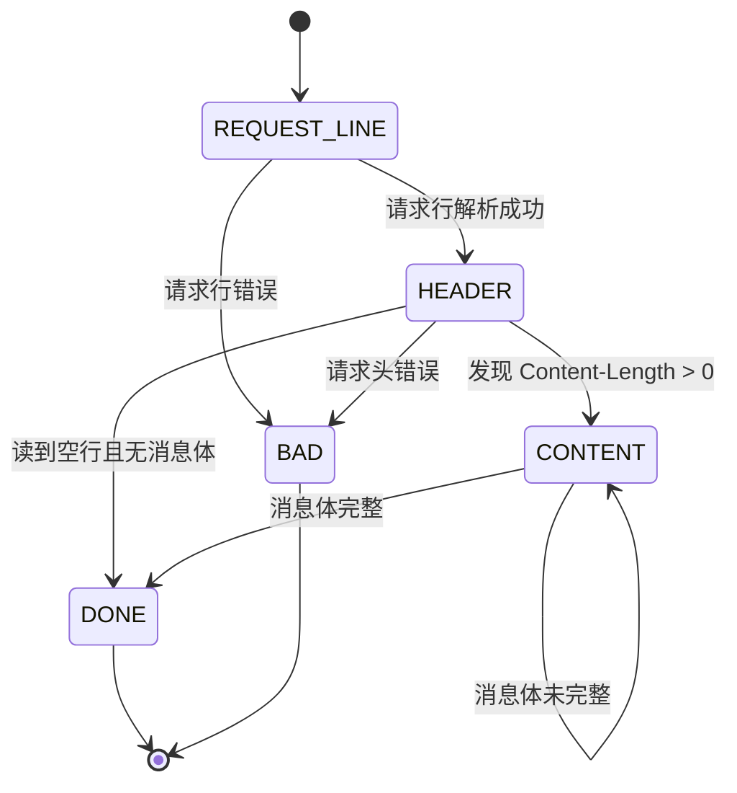
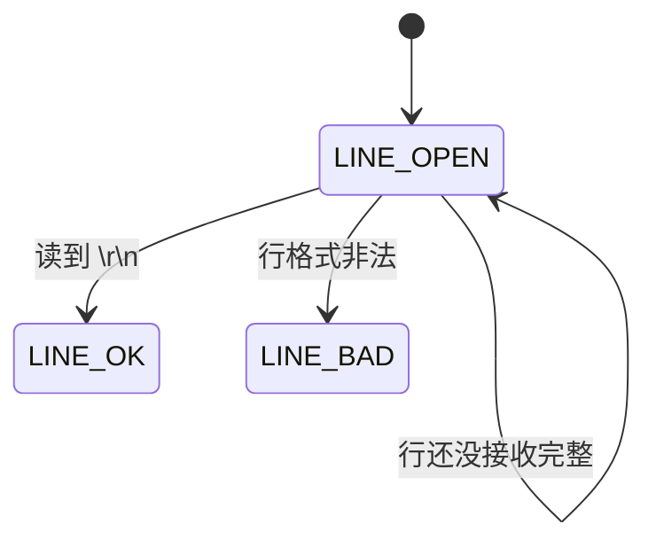

# TinyWebServer 面试问答模拟版

> [!note]
> 这份笔记按照“问题 + 可直接回答的答案”来写。你可以直接拿来做自问自答练习。

## 项目介绍

### 问：为什么要做这样一个项目？

答：  
我做这个项目主要是为了系统学习 Linux 下高并发服务器的核心技术，而不是单纯做一个网页应用。普通业务项目更偏向功能开发，但这个项目能让我把 `socket`、`epoll`、非阻塞 I/O、线程池、状态机、数据库连接池、定时器、日志系统这些底层能力串起来。它比较像一个综合练习项目，能把操作系统、计算机网络和 C++ 并发编程的知识真正落到代码上。

### 问：介绍下你的项目。

答：  
这是一个运行在 Linux 上的轻量级 C++ Web 服务器。主线程使用 `epoll` 监听监听 socket、连接 socket 和信号管道，工作线程通过线程池处理请求；每个客户端连接都抽象成一个 `http_conn` 对象；HTTP 报文解析使用主从状态机；数据库访问通过 MySQL 连接池复用连接；空闲连接通过升序定时器链表回收；日志支持同步和异步两种模式。业务上实现了静态资源访问、用户注册和登录功能，并支持 Reactor 和 Proactor 两种事件处理模型。

## 线程池相关

### 问：手写线程池。

答：  
线程池的核心组成有四部分：

1. 线程集合  
   启动时创建固定数量的工作线程。

2. 任务队列  
   主线程把待处理请求封装成任务，放进队列。

3. 同步机制  
   用互斥锁保护任务队列，用信号量或条件变量表示“队列里有任务可以处理”。

4. 工作循环  
   工作线程不断重复“等待任务 -> 取任务 -> 执行任务 -> 回到等待”。

结合这个项目来说，线程池里保存的是 `http_conn*` 类型的任务对象。主线程检测到读写事件后，把对应连接对象放到任务队列；工作线程被唤醒后取出连接对象，然后根据 Reactor 或 Proactor 模式执行读、写或业务处理。

### 问：线程的同步机制有哪些？

答：  
常见的线程同步机制有：

- 互斥锁 `mutex`
  保证同一时刻只有一个线程访问临界区
- 读写锁
  适合读多写少场景
- 条件变量
  用于线程间等待和通知
- 信号量
  用于表示资源数量，线程池和连接池里很常用
- 原子变量
  适合简单计数和标志位
- 自旋锁
  适合锁持有时间很短的场景

这个项目里主要用了：

- `locker` 封装的互斥锁
- `sem` 封装的信号量
- `cond` 封装的条件变量

### 问：线程池中的工作线程是一直等待吗？

答：  
是的。线程池中的工作线程不会处理完一个任务就退出，而是一直存在。它们平时阻塞在信号量或者条件变量上，只有当主线程往任务队列里压入任务并发出通知时，工作线程才会被唤醒处理。处理完后又重新进入等待状态。

### 问：你的线程池工作线程处理完一个任务后的状态是什么？

答：  
处理完一个任务后，工作线程不会销毁，而是回到线程池继续等待下一个任务。也就是说，它会重新阻塞在“任务可用”的同步机制上。这样可以避免频繁创建和销毁线程带来的开销。

### 问：如果同时 1000 个客户端进行访问请求，线程数不多，怎么能及时响应处理每一个呢？

答：  
关键点在于“连接数”和“线程数”不是一一对应的。这个项目依赖的是 `epoll + 非阻塞 I/O + 线程池` 模型：

- `epoll` 负责高效监听大量连接
- 非阻塞 I/O 保证一个慢连接不会卡死线程
- 线程池线程只在连接真正有事件且需要处理时才工作

实际上 1000 个连接里，大部分时间很多连接都处于等待状态，不会一直消耗 CPU。线程池只需要处理当前活跃的那部分请求，而不需要给每个连接都分配一个线程。

### 问：如果一个客户请求需要占用线程很久的时间，会不会影响接下来的客户请求呢，有什么好的策略呢？

答：  
会影响。如果线程池里的某个线程长期被一个慢任务占住，那么剩余线程能处理的新任务就会减少，严重时会导致队列积压。

常见优化策略有：

- 将耗时任务异步化  
  比如交给独立的后台任务系统，不在网络线程池里直接做
- 做业务线程池分级  
  I/O 线程池和业务线程池分开
- 设置任务超时和熔断  
  防止单个请求无限占用资源
- 使用更细粒度的任务拆分  
  把一个大任务切成多个短任务
- 对热点接口做缓存  
  减少重复计算

如果是我继续优化这个项目，我会考虑把网络 I/O 线程和真正的业务处理线程再拆开，避免重业务阻塞网络事件处理。

## 并发模型相关

### 问：简单说一下服务器使用的并发模型？

答：  
这个项目整体使用的是“半同步 / 半反应堆”并发模型。

- 反应堆部分：主线程使用 `epoll` 监听事件并做事件分发
- 同步部分：工作线程同步处理具体任务

所以主线程主要负责：

- `accept`
- `epoll_wait`
- 判断事件类型
- 分发任务

工作线程主要负责：

- 读写数据
- 解析 HTTP
- 执行业务逻辑
- 构造响应

### 问：reactor、proactor、主从 reactor 模型的区别？

答：  
三者区别主要在于“谁负责 I/O”以及“有没有多层事件分发”。

Reactor：

- 内核告诉你“某个 fd 可读 / 可写”
- 应用程序自己去做读写
- 适合非阻塞 I/O 场景

Proactor：

- 应用提交异步 I/O 请求
- 内核帮你完成真正的读写
- 完成后再通知应用“结果已就绪”

主从 Reactor：

- 主 Reactor 负责监听连接建立事件
- 从 Reactor 负责监听已连接 socket 的读写事件
- 多线程高并发场景下更常见

这个项目里的 Reactor / Proactor 更偏工程上的实现方式：

- Reactor：线程池线程做 `read/write`
- Proactor：主线程先 `read`，线程池只做逻辑处理

### 问：你用了 epoll，说一下为什么用 epoll，还有其他复用方式吗？区别是什么？

答：  
我用 `epoll` 主要是因为它更适合高并发连接场景。

其他常见 I/O 复用方式有：

- `select`
- `poll`
- `epoll`

区别：

`select`：

- 需要把 fd 集合从用户态拷贝到内核态
- 有最大 fd 数限制
- 每次都要遍历所有 fd 找就绪项

`poll`：

- 没有固定 fd 上限
- 但本质还是线性遍历所有 fd

`epoll`：

- 内核维护就绪队列
- 只返回活跃 fd
- fd 数量大时效率更高
- 支持 LT 和 ET

所以在连接数较大的服务器场景下，`epoll` 更合适。

## HTTP 报文解析相关

### 问：用了状态机啊，为什么要用状态机？

答：  
因为 TCP 是面向字节流的，应用层收到的数据不一定刚好是一个完整的 HTTP 请求。  
比如：

- 可能一次只收到半个请求头
- 也可能一次收到了两个请求

所以不能简单靠一次 `recv()` 就直接处理。  
需要用状态机按阶段解析：

- 先解析请求行
- 再解析请求头
- 如果有消息体，再解析请求体

状态机的价值就是把“分段到达、不完整到达”的数据稳定地拼成一个完整 HTTP 请求。

### 问：状态机的转移图画一下。

答：  
这个项目可以理解为“主状态机 + 从状态机”。

主状态机：

从状态机：

可以这样解释：

- 从状态机负责“从缓冲区切出一行”
- 主状态机负责“当前这行应该按请求行、请求头还是请求体来解释”

### 问：https 协议为什么安全？

答：  
HTTPS 安全主要靠 TLS/SSL，核心体现在三点：

1. 机密性  
   传输内容会被加密，第三方即使截获数据也看不懂。

2. 身份认证  
   通过数字证书验证服务器身份，防止访问到伪造网站。

3. 完整性  
   通过摘要和 MAC 机制保证报文在传输过程中没有被篡改。

简单说，HTTP 是明文传输，而 HTTPS 是“HTTP + TLS”。

### 问：https 的 ssl 连接过程。

答：  
以经典 TLS 握手流程来说，大致是：

1. 客户端发起连接，请求建立 TLS 会话，并告知支持的加密套件
2. 服务端返回证书、公钥、协商好的加密套件等信息
3. 客户端验证证书是否合法，确认服务端身份
4. 客户端生成预主密钥或密钥材料，用服务端公钥加密发送
5. 服务端用私钥解密
6. 双方根据协商结果生成对称会话密钥
7. 后续实际传输阶段使用对称加密通信

因为非对称加密计算代价大，所以握手阶段主要用于身份认证和密钥交换，真正传输数据通常使用效率更高的对称加密。

### 问：GET 和 POST 的区别。

答：  
主要区别有：

- GET 常用于获取资源，POST 常用于提交数据
- GET 参数通常放在 URL，POST 参数通常放在请求体
- GET 更强调幂等性和可缓存性
- POST 通常用于会修改服务器状态的操作
- GET 更容易受 URL 长度限制影响，POST 相对更适合传输较多数据

但本质上它们都是 HTTP 方法，安全性不是由 GET / POST 决定的，而是由是否使用 HTTPS 决定的。

## 数据库登录注册相关

### 问：登录说一下？

答：  
这个项目的登录流程是这样的：

1. 浏览器提交登录表单，发送 POST 请求
2. `http_conn` 读取请求数据
3. 状态机解析请求行、请求头和请求体
4. 从请求体中提取用户名和密码
5. 项目启动时已经把数据库里的用户信息加载到了内存 `map`
6. 登录时直接在 `map` 中匹配用户名和密码
7. 匹配成功返回 `welcome.html`
8. 匹配失败返回 `logError.html`

也就是说，这个项目登录校验的高频查询走的是内存，不是每次都直接查 MySQL。

### 问：你这个保存状态了吗？如果要保存，你会怎么做？（cookie 和 session）

答：  
当前这个项目本身并没有实现完整的登录状态保持。  
它更多是做了“提交表单 -> 校验 -> 返回页面”这一步，没有真正意义上的会话管理。

如果要保存登录状态，我会用 `Cookie + Session` 方案：

1. 用户登录成功后，服务端生成一个 `session_id`
2. 把 `session_id` 作为 Cookie 返回给浏览器
3. 服务端把 `session_id` 和用户信息存到 Session 存储中
4. 用户后续请求自动带上 Cookie
5. 服务端根据 `session_id` 找到对应用户，实现登录态保持

如果进一步优化，可以把 Session 存到 Redis，这样更适合分布式扩展。

### 问：登录中的用户名和密码你是 load 到本地，然后使用 map 匹配的，如果有 10 亿数据，即使 load 到本地后 hash，也是很耗时的，你要怎么优化？

答：  
这个问题说明当前实现只适合小规模教学场景，不适合超大规模用户系统。

如果用户规模特别大，我会这样优化：

1. 不做全量加载  
   不能把 10 亿用户一次性加载到本地内存，内存成本太高，启动时间也会不可接受。

2. 登录走数据库索引查询  
   给用户名建立唯一索引，只查当前登录用户这一条记录。

3. 使用缓存系统  
   把热点用户信息放 Redis，比如最近活跃用户、频繁登录用户。

4. 做分库分表  
   当单表数据量过大时，把用户表按规则拆分。

5. 密码绝不能明文存储  
   应该存储加盐哈希值，登录时做哈希比对。

6. 引入布隆过滤器  
   可先快速判断“这个用户名大概率不存在”，减少无效查询。

所以如果是工业级系统，正确思路不是“把所有数据装进 map”，而是“索引 + 缓存 + 分片 + 安全存储”。

### 问：用的 mysql 啊，redis 了解吗？用过吗？

答：  
了解。Redis 是一个基于内存的高性能键值数据库，常见用途有：

- 缓存热点数据
- Session 存储
- 分布式锁
- 消息队列
- 排行榜、计数器等场景

如果我来优化这个项目，我会优先考虑两种使用方式：

1. 把登录 Session 存到 Redis  
   实现用户状态保持

2. 把热点用户信息或页面缓存到 Redis  
   减少数据库压力

MySQL 更偏持久化关系型存储，Redis 更偏高速缓存和临时状态管理，二者通常配合使用。

## 定时器相关

### 问：为什么要用定时器？

答：  
因为服务器里会有很多“连上了但不干活”的空闲连接。如果不及时清理，这些连接会一直占用：

- fd
- 内存
- epoll 监听资源

所以需要定时器来回收长时间不活跃的连接，防止资源泄漏和连接堆积。

### 问：说一下定时器的工作原理。

答：  
这个项目里，每个客户端连接建立时都会创建一个定时器，记录它的过期时间。

运行过程是：

1. 新连接建立时，插入一个定时器节点
2. 如果这个连接发生读写活动，就刷新它的过期时间
3. 主线程通过 `alarm` 周期性收到 `SIGALRM`
4. 信号被写入管道，由 `epoll` 统一处理
5. 处理信号时调用定时器链表的 `tick()`
6. 从链表头开始处理所有已经超时的连接，执行关闭连接回调

因为链表按过期时间升序排列，所以只要头节点没超时，后面的也一定没超时。

### 问：双向链表啊，删除和添加的时间复杂度说一下？还可以优化吗？

答：  
这个项目的定时器链表是按过期时间有序的双向链表。

时间复杂度：

- 如果已知节点位置，删除节点本身是 `O(1)`
- 但为了保持有序，插入通常需要找到位置，所以平均是 `O(n)`
- 调整定时器位置本质上也可能是 `O(n)`

可以优化。

优化方向之一是最小堆：

- 插入是 `O(log n)`
- 删除堆顶是 `O(log n)`
- 获取最早过期时间是 `O(1)`

对于大量定时器场景，最小堆通常比有序链表更合适。

### 问：最小堆优化？说一下时间复杂度和工作原理。

答：  
最小堆会把“最早过期的定时器”放在堆顶。

工作原理：

1. 每个定时器节点作为堆中一个元素
2. 按过期时间排序，父节点总是比子节点更早过期
3. 检查超时时只看堆顶
4. 如果堆顶已过期，就弹出并执行回调，再继续检查新的堆顶
5. 如果堆顶未过期，就说明所有节点都还没超时

时间复杂度：

- 插入：`O(log n)`
- 删除堆顶：`O(log n)`
- 获取堆顶：`O(1)`
- 批量处理过期任务：每个节点大约 `O(log n)`

所以当定时器数量很多时，最小堆在整体效率上通常优于有序链表。

## 日志相关

### 问：说下你的日志系统的运行机制？

答：  
这个项目的日志系统支持同步和异步两种模式。

同步模式下：

- 业务线程直接格式化日志
- 直接写日志文件

异步模式下：

- 业务线程先把日志写成字符串
- 放入阻塞队列
- 专门的后台日志线程不断从队列取日志并写入文件

日志系统还支持：

- 按日期切分日志文件
- 按行数切分日志文件
- 不同级别日志输出

### 问：为什么要异步？和同步的区别是什么？

答：  
因为磁盘写入比较慢，如果业务线程每次都直接写盘，会阻塞主流程，降低服务器吞吐。

同步和异步的区别：

同步日志：

- 调用线程直接写文件
- 实现简单
- 但会阻塞当前线程

异步日志：

- 调用线程只负责把日志放进队列
- 后台线程统一写文件
- 业务线程阻塞更少，吞吐更高

高并发服务器更适合异步日志，因为它能把“业务处理”和“落盘 I/O”解耦。

### 问：现在你要监控一台服务器的状态，输出监控日志，请问如何将该日志分发到不同的机器上？（消息队列）

答：  
可以通过消息队列做日志分发。

思路是：

1. 服务器本地生成监控日志
2. 不直接发到多个下游，而是先写入消息队列，比如 Kafka、RabbitMQ
3. 不同机器作为消费者订阅对应主题
4. 各自消费日志并做自己的处理，比如：
   - 一台做实时告警
   - 一台做离线分析
   - 一台做可视化展示

这样做的优点是：

- 解耦生产者和消费者
- 支持多消费者扩展
- 支持削峰填谷
- 支持失败重试和持久化

## 压测相关

### 问：服务器并发量测试过吗？怎么测试的？

答：  
测试过。这个项目自带了 `webbench` 压测工具。  
常见测试方式是：

1. 先启动服务器
2. 关闭日志或选择较轻配置，减少测试噪声
3. 使用 `webbench` 指定并发连接数、压测时长、目标 URL
4. 观察：
   - QPS
   - 总请求数
   - 成功请求数
   - 失败请求数

这个项目 README 里也给出了不同 LT / ET 和 Reactor / Proactor 组合下的压测结果。

### 问：webbench 是什么？介绍一下原理。

答：  
`webbench` 是一个轻量级 Web 压力测试工具，用来模拟多个客户端并发访问服务器。

它的基本原理是：

1. 创建多个并发客户端
2. 重复向目标服务器发送 HTTP 请求
3. 在设定时间内统计：
   - 请求总数
   - 每秒请求数
   - 成功率

本质上就是“用程序模拟大量客户端持续发请求，然后统计吞吐和稳定性”。

### 问：测试的时候有没有遇到问题？

答：  
有，压测时通常会暴露几个典型问题：

- 日志过多会影响性能  
  所以压测时通常会关闭日志或减少日志输出

- ET 模式下如果没有把数据一次性读完，会漏掉事件  
  所以 ET 模式必须循环读到 `EAGAIN`

- 长连接和短连接策略会影响结果  
  keep-alive 行为不同，测试结果也会不同

- 资源上限问题  
  比如文件描述符上限、线程数、数据库连接数配置不合理时，可能出现吞吐下降

这类问题也说明压测不仅是测性能，也是帮我们暴露系统设计中的瓶颈。

## 综合能力

### 问：你的项目解决了哪些其他同类项目没有解决的问题？

答：  
如果和很多只实现“简单 socket 收发”的教学项目比，这个项目解决得更完整：

1. 并发模型更完整  
   不只是单线程处理，而是引入了 `epoll + 线程池`

2. 支持 Reactor 和 Proactor 两种模式  
   可以体现不同 I/O 处理思路

3. 加入了数据库连接池  
   不是每次请求临时连 MySQL

4. 加入了定时器回收机制  
   能处理不活跃连接

5. 加入了同步 / 异步日志系统  
   更接近真实服务器工程需求

6. HTTP 处理更系统  
   用状态机解析报文，而不是简单字符串匹配

当然它仍然是一个教学型项目，和真正工业级 Web 服务器相比，在安全性、扩展性和业务层设计上还有很大提升空间。

### 问：说一下前端发送请求后，服务器处理的过程，中间涉及哪些协议？

答：  
前端发送请求到服务器，大致经过下面这条链路：

1. 浏览器先根据 URL 判断协议类型  
   可能是 HTTP 或 HTTPS

2. 如果是域名访问，会先做 DNS 解析  
   把域名解析成 IP 地址

3. 浏览器和服务器建立 TCP 连接  
   进行三次握手

4. 如果是 HTTPS，还要先做 TLS/SSL 握手  
   完成证书验证和密钥协商

5. 浏览器发送 HTTP 请求报文  
   包括请求行、请求头、请求体

6. 服务器内核收到 TCP 数据包，放入 socket 接收缓冲区

7. 服务器主线程通过 `epoll` 感知连接可读

8. 主线程或工作线程读取数据到用户态缓冲区

9. 应用层解析 HTTP 报文，执行业务逻辑

10. 服务器生成 HTTP 响应报文

11. 响应通过 TCP 发回浏览器

12. 浏览器解析 HTML / CSS / JS，继续发起静态资源请求

中间涉及的协议主要有：

- DNS
- TCP
- HTTP
- HTTPS 对应的 TLS/SSL
- 底层还依赖 IP 协议做网络传输

## 额外建议：这些题你怎么答更稳

> [!tip]
> 回答项目题时，建议固定结构：
> 1. 先说“这个模块是为了解决什么问题”
> 2. 再说“它怎么实现”
> 3. 最后说“优点和可以优化的点”

> [!success]
> 如果你被追问到不会的地方，不要硬编。最稳的说法是：
> “这个项目当前实现是教学型的，工程上我会进一步这么优化……”

