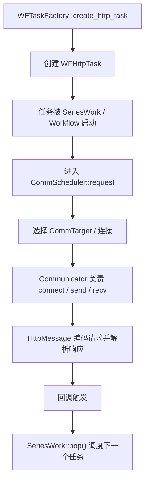
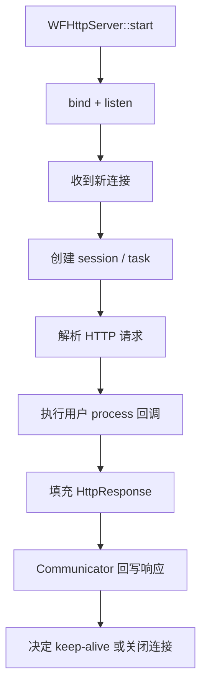

# Workflow-04 HTTP 请求与服务端链路

相关笔记：
[[Workflow项目面试拆解]] | [[Workflow-03 从零实现这个框架的思路]] | [[Workflow-05 核心抽象：SubTask、SeriesWork、ParallelWork、Workflow]] | [[Workflow-07 上层模块：WFTaskFactory、Server、Client]]

## 为什么这一章最重要

面试里最容易被追问的是：

- 一个 HTTP 请求在框架里怎么走？
- 一个 HTTP Server 收到请求后怎么处理？

如果你能把这一章讲清楚，面试官会觉得你不是只看了 README。

## HTTP 客户端请求链路



## 口语化讲法

你可以这样说：

1. 用户先通过 `WFTaskFactory` 创建一个 HTTP 任务。
2. 这个任务本质上是一个包装好的网络会话。
3. 任务启动后，调度器去选择目标地址和可用连接。
4. `Communicator` 负责真正的非阻塞通信，包括 connect、send、recv。
5. 协议层把收到的字节解析成 `HttpResponse`。
6. 最后回到用户 callback。
7. 如果这个任务在一个串行工作流里，结束后会自动调度下一个任务。

## HTTP 服务端请求链路



## 服务端口语化讲法

你可以这样讲：

1. `WFHttpServer` 先启动监听。
2. 有连接进来时，底层创建一个新的会话。
3. 这个会话被包装成 `WFHttpTask`。
4. 协议层把收到的数据解析成 `HttpRequest`。
5. 用户写的 `process(task)` 回调开始执行。
6. 回调里修改 `task->get_resp()`。
7. 框架再把响应编码并发回客户端。

## 结合 Hello World 示例怎么讲

示例文件：`tutorial/tutorial-00-helloworld.cc`

```cpp
#include <stdio.h>
#include "workflow/WFHttpServer.h"

int main()
{
    WFHttpServer server([](WFHttpTask *task) {
        task->get_resp()->append_output_body("<html>Hello World!</html>");
    });

    if (server.start(8888) == 0) {
        getchar();
        server.stop();
    }

    return 0;
}
```

这段代码可以拆成三句话：

- `WFHttpServer` 负责监听和请求生命周期。
- lambda 是用户业务逻辑。
- `append_output_body()` 是往 `HttpResponse` 里填内容，剩下的发送动作由框架完成。

## 面试时最容易加分的点

你可以补一句：

这个框架的厉害之处在于，用户看到的是一个简单的任务对象，但它背后可能已经隐含了 DNS、连接管理、发送、接收、协议解析、超时控制和回调调度这些复杂步骤。
