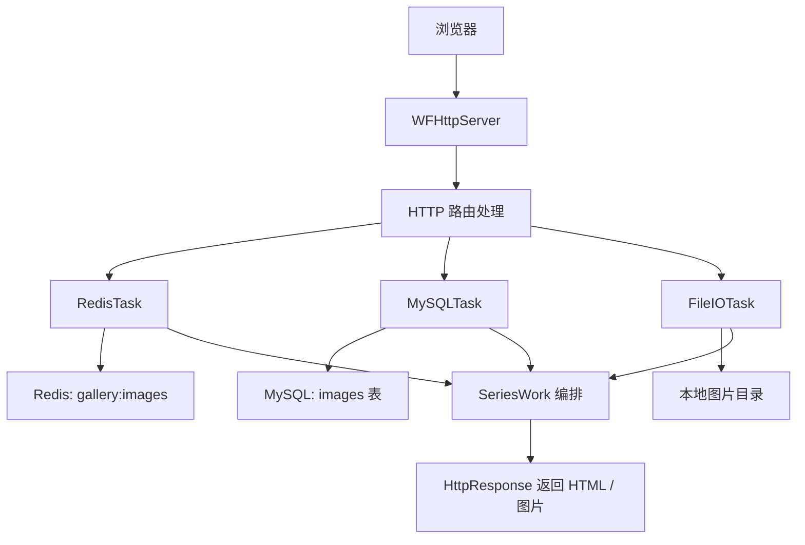

# Workflow-12 随机图库面试项目规划

相关笔记：
[[Workflow项目面试拆解]] | [[Workflow-01 项目定位与一句话介绍]] | [[Workflow-04 HTTP 请求与服务端链路]] | [[Workflow-05 核心抽象：SubTask、SeriesWork、ParallelWork、Workflow]] | [[Workflow-07 上层模块：WFTaskFactory、Server、Client]] | [[Workflow-11 部署与测试]]

## 这一章回答什么

这一章专门规划一个适合面试展示的小项目：

**基于 Workflow 的高并发随机图库网站。**

项目目标是：

- 用户访问网站时，随机返回 5 张图片
- 图片库由自己提供，图片数量大于 5 张
- Redis 负责随机抽取和缓存
- MySQL 负责持久化图片信息
- Workflow 负责 HTTP 服务、异步任务和高并发调度

这个项目不追求业务复杂，而是为了把 Workflow 最核心的能力串起来。

## 项目定位

这个项目可以描述为：

一个基于 Workflow 框架实现的异步随机图库服务。HTTP 层接收用户访问和上传请求，Redis 用来维护可随机抽取的图片集合和热点缓存，MySQL 用来持久化图片元数据，图片文件保存在本地磁盘或对象存储中。一次请求内部通过 Workflow 的 `SeriesWork` 串联 Redis、MySQL 和 File IO 等异步任务，底层由 Workflow 的异步通信和调度模型支撑高并发。

## 不建议把图片二进制直接存 MySQL

这里要先明确一个工程设计点：

**不建议把图片文件本体直接存 MySQL。**

更推荐的设计是：

```text
本地磁盘 / static/images/xxx.jpg    存真实图片文件
MySQL images 表                    存图片 id、文件名、路径、大小、上传时间、用户信息
Redis                              存可随机抽取的图片 id 集合，以及热点元数据缓存
```

为什么这样更适合面试：

- MySQL 更适合存结构化元数据
- 图片二进制放数据库会让表膨胀
- 大文件读写会增加数据库压力
- 本地文件或对象存储更符合真实工程设计
- Redis 可以做随机集合和热点缓存

如果面试官追问“为什么不直接把图片存 MySQL”，可以回答：

真实项目里通常不会把大量图片二进制直接塞进 MySQL。MySQL 负责可靠地存元数据，图片文件放文件系统或对象存储，Redis 负责缓存和随机索引。这样可以降低数据库 IO 压力，也更方便做 CDN、缓存和静态文件服务。

## 整体架构



一句话：

浏览器只看到一个普通网站，但服务端内部其实是多个异步任务组成的工作流。

## 功能设计

### 1. 首页随机图片

接口：

```text
GET /
```

流程：

```text
HTTP 请求
-> Redis task: SRANDMEMBER gallery:images 5
-> MySQL task: SELECT id, filename, path FROM images WHERE id IN (...)
-> 拼接 HTML
-> HTTP response 返回 5 张图片
```

Redis 中可以维护一个集合：

```text
SADD gallery:images 1 2 3 4 5 6 7 8 9 10
```

随机取 5 个：

```text
SRANDMEMBER gallery:images 5
```

返回 HTML 类似：

```html


```

### 2. 上传图片

接口：

```text
POST /upload
```

流程：

```text
HTTP 请求
-> 解析上传内容
-> FileIO task: 保存图片到本地目录
-> MySQL task: INSERT 图片元数据
-> Redis task: SADD gallery:images image_id
-> HTTP response 返回上传成功
```

这里上传模块可以分阶段实现。

第一版可以先不做复杂 multipart 解析，而是用固定目录里的图片初始化数据库和 Redis。等主流程跑通后，再补真正上传。

### 3. 访问单张图片

接口：

```text
GET /image/{id}
```

流程：

```text
HTTP 请求
-> Redis task: 查图片路径缓存
-> 缓存没有则 MySQL task 查询路径
-> FileIO task 读取图片文件
-> HTTP response 返回 image/jpeg 或 image/png
```

这一条链路能展示完整的缓存思路：

- 先查 Redis
- Redis 没有再查 MySQL
- 查到后可以回写 Redis
- 最后读文件并返回

## MySQL 表设计

可以先设计一张简单的 `images` 表：

```sql
CREATE TABLE images (
    id BIGINT PRIMARY KEY AUTO_INCREMENT,
    filename VARCHAR(255) NOT NULL,
    storage_path VARCHAR(512) NOT NULL,
    content_type VARCHAR(64) NOT NULL,
    file_size BIGINT NOT NULL,
    uploader VARCHAR(128),
    created_at TIMESTAMP DEFAULT CURRENT_TIMESTAMP
);
```

字段怎么讲：

| 字段 | 作用 |
|---|---|
| `id` | 图片唯一 ID |
| `filename` | 原始文件名或展示文件名 |
| `storage_path` | 本地磁盘路径 |
| `content_type` | `image/jpeg`、`image/png` 等 |
| `file_size` | 文件大小 |
| `uploader` | 上传用户，可选 |
| `created_at` | 上传时间 |

## Redis 设计

Redis 主要承担两个角色：

1. 随机图库集合
2. 热点图片元数据缓存

### 随机集合

```text
gallery:images
```

类型：Set

用途：

```text
SADD gallery:images 1
SRANDMEMBER gallery:images 5
```

### 图片路径缓存

```text
image:meta:{id}
```

类型：Hash 或 String

示例：

```text
HSET image:meta:1 filename a.jpg path /static/images/a.jpg content_type image/jpeg
HGETALL image:meta:1
```

面试中可以说：

Redis 既能做随机集合，也能做热点数据缓存。首页随机推荐时直接从 Set 中取 id，访问图片详情时优先查 Redis，未命中再查 MySQL。

## 需要重点学习的 Workflow 模块

### 第一层：能做出项目

这些模块必须先学：

| 模块 | 用途 |
|---|---|
| `WFHttpServer` | 接收 `/`、`/upload`、`/image/{id}` 请求 |
| `WFTaskFactory::create_redis_task()` | 创建 Redis 异步任务 |
| `WFTaskFactory::create_mysql_task()` | 创建 MySQL 异步任务 |
| `WFTaskFactory::create_pread_task()` / `create_pwrite_task()` | 异步读写图片文件 |
| `SeriesWork` | 把 HTTP、Redis、MySQL、File IO 串起来 |
| `HttpRequest / HttpResponse` | 读取请求、写 HTML/JSON/图片响应 |
| `RedisMessage / RedisResponse` | 设置 Redis 命令、读取 Redis 结果 |
| `MySQLMessage / MySQLResult` | 设置 SQL、读取查询结果 |

一句话：

先学这些，就能把项目主体跑起来。

### 第二层：能讲清楚异步流程

这些模块是面试加分项：

| 模块 | 面试价值 |
|---|---|
| `SubTask` | 理解所有任务的共同抽象 |
| `WFNetworkTask` | 理解 HTTP、Redis、MySQL 为什么能统一调度 |
| `CommRequest` | 理解网络任务怎么进入通信调度 |
| `Workflow / SeriesWork / ParallelWork` | 理解串行和并行编排 |
| `WFGlobal` | 理解全局线程和资源从哪里来 |

核心链路：

```text
HTTP 请求进来
-> WFHttpServer 创建 WFHttpTask
-> process 回调里创建 RedisTask / MySQLTask / FileIOTask
-> 通过 SeriesWork 挂到当前请求后面
-> Redis/MySQL/File 任务异步执行
-> callback 填充 HttpResponse
-> Workflow 自动推进到 HTTP 回复阶段
```

### 第三层：理解高并发底层

如果想深入讲 Workflow 为什么高并发，要继续看：

| 模块 | 作用 |
|---|---|
| `Communicator` | 底层通信引擎，负责非阻塞 IO、连接、收发、监听、定时器、文件 IO 接入 |
| `CommScheduler` | 连接目标选择、连接数控制、负载管理 |
| `poller / mpoller` | 事件循环，Linux 下对应 epoll 思路 |
| `thrdpool` | 底层线程池实现 |
| `Executor / ExecRequest` | 计算任务线程池 |
| `IOService` | 文件 IO 服务 |
| `WFGlobalSettings` | 全局并发参数配置 |

`WFGlobalSettings` 中值得关注：

```cpp
struct WFGlobalSettings
{
    EndpointParams endpoint_params;
    int dns_threads;
    int poller_threads;
    int handler_threads;
    int compute_threads;
    int fio_max_events;
};
```

面试里要能讲出：

- Workflow 不是一请求一线程
- poller 线程负责监听 IO 事件
- handler 线程负责处理事件和回调
- compute 线程池负责计算任务
- DNS 有自己的解析机制
- 文件 IO 由 IOService 接入
- HTTP、Redis、MySQL 都是异步网络任务，所以可以统一调度

## 推荐学习顺序

不要从 `Communicator.cc` 开始硬啃。推荐按项目倒推源码。

### 第 1 步：跑通 HTTP

看：

- `tutorial-00-helloworld.cc`
- `tutorial-04-http_echo_server.cc`

目标：

- 知道 `WFHttpServer` 怎么启动
- 知道怎么写 `HttpResponse`
- 知道用户请求怎么进入 `process(task)`

### 第 2 步：学 Redis task

看：

- `tutorial-02-redis_cli.cc`

目标：

- 会创建 `WFRedisTask`
- 会设置 Redis 命令
- 会读取 Redis 返回结果

### 第 3 步：学 MySQL task

看：

- `tutorial-12-mysql_cli.cc`

目标：

- 会创建 `WFMySQLTask`
- 会执行 SQL
- 会读取 MySQL 查询结果

### 第 4 步：学任务串联

看：

- `tutorial-03-wget_to_redis.cc`
- [[Workflow-05 核心抽象：SubTask、SeriesWork、ParallelWork、Workflow]]

目标：

- 理解任务不是同步阻塞执行
- 理解如何把任务追加到当前 `SeriesWork`
- 理解一个任务完成后怎么调度下一个任务

### 第 5 步：学文件 IO

看：

- `tutorial-09-http_file_server.cc`

目标：

- 会读取本地图片文件
- 会把图片 body 写入 HTTP response
- 会设置 `Content-Type`

### 第 6 步：实现项目第一版

先只实现：

```text
GET /
-> Redis 随机取 5 个图片 id
-> MySQL 查图片路径
-> 返回 HTML
```

这一版先不做上传，也可以先把图片和数据库数据手动初始化。

### 第 7 步：加入上传

再实现：

```text
POST /upload
-> 保存图片文件
-> INSERT MySQL
-> SADD Redis
-> 返回上传成功
```

### 第 8 步：补缓存和压测

再补：

- Redis 缓存图片元数据
- `/image/{id}` 访问图片
- `wrk` 或 `ab` 压测
- 记录 QPS、延迟、失败率

### 第 9 步：反向读源码

源码阅读顺序：

```text
SubTask.h / SubTask.cc
Workflow.h / Workflow.cc
WFTask.h
WFTask.inl
CommRequest.h / CommRequest.cc
CommScheduler.h / CommScheduler.cc
Communicator.h
WFGlobal.h
Executor.h / thrdpool.c
```

这样读的好处是：

你已经知道项目怎么跑，再回头看源码时，就能把源码和自己的项目流程对应起来。

## 暂时不用深入的模块

这些模块可以知道存在，但第一阶段不用深挖：

- Kafka
- Consul
- 自定义协议
- DNS Server
- Redis Subscriber
- GraphTask
- Upstream 服务治理
- SSL 细节
- TLV 协议
- MySQL 协议解析细节
- HTTP parser 细节

原因：

它们不是随机图库项目的主链路。第一阶段应该先集中精力把 HTTP、Redis、MySQL、File IO 和 Workflow 编排学明白。

## 项目可量化指标

这个项目没有复杂前端，但可以用后端指标量化。

| 测试项 | 怎么测 | 指标 |
|---|---|---|
| 首页随机图 | `curl /` | 是否返回 5 张图片 |
| Redis 随机集合 | 多次请求首页 | 图片组合是否变化 |
| MySQL 查询 | 查看 SQL 结果 | 是否返回正确路径 |
| 图片访问 | `curl /image/{id}` | 是否返回正确图片 body |
| 上传接口 | 上传一张图片 | 文件、MySQL、Redis 是否同步更新 |
| 并发访问 | `wrk` 压测 `/` | QPS、平均延迟、P99、错误率 |
| 缓存效果 | Redis 命中前后对比 | MySQL 查询次数是否下降 |
| 串行编排 | 打日志 | Redis -> MySQL -> Response 顺序是否正确 |

压测命令示例：

```bash
wrk -t4 -c100 -d30s http://127.0.0.1:8888/
```

或者：

```bash
ab -n 10000 -c 100 http://127.0.0.1:8888/
```

## 面试里的项目讲法

可以这样说：

我基于 Workflow 做了一个异步随机图库服务。HTTP 层负责接收用户访问和上传请求，Redis 用来维护可随机抽取的图片集合和缓存热点元数据，MySQL 用来持久化图片信息，图片文件实际存储在本地文件系统。一次请求内部不是同步阻塞执行，而是把 Redis、MySQL、File IO 都封装成 Workflow task，通过 `SeriesWork` 串起来。底层由 Workflow 的 poller 线程、handler 线程、通信调度器和文件 IO 服务完成异步调度，所以可以用较少线程支撑较高并发。

## 如果面试官追问高并发

可以继续这样讲：

这个项目里 HTTP、Redis、MySQL 都不是同步阻塞模型，而是 Workflow 的异步网络任务。请求进入 `WFHttpServer` 后，业务代码只是创建后续任务并挂入当前 `SeriesWork`。底层真正的网络收发由 `Communicator` 和 poller 线程处理，任务完成后再回到 handler 线程触发 callback。这样就避免了一个请求占用一个线程等待 Redis 或 MySQL 返回的问题。

## 最后总结

这个项目最适合用来学习 Workflow 的原因是：

- 它有真实 HTTP 入口
- 它用到了 Redis
- 它用到了 MySQL
- 它能接入 File IO
- 它能体现 `SeriesWork` 任务编排
- 它能用压测量化高并发效果
- 它的复杂度适合面试，不会大到失控

一句话：

**不要先试图完整啃完整个 Workflow。先围绕随机图库项目学会 `WFHttpServer + RedisTask + MySQLTask + FileIOTask + SeriesWork`，再反向阅读 `SubTask -> WFTask -> CommRequest -> CommScheduler -> Communicator` 这条源码链。**
